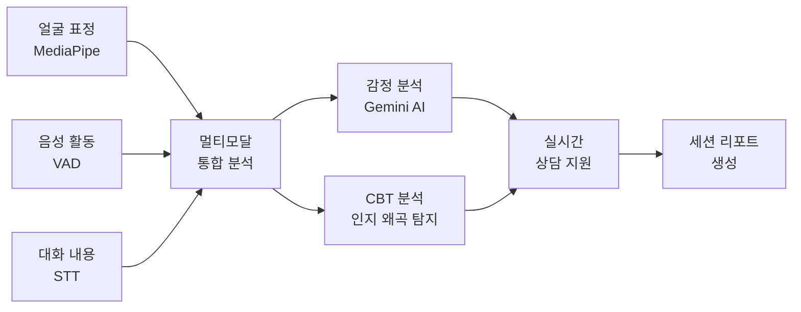
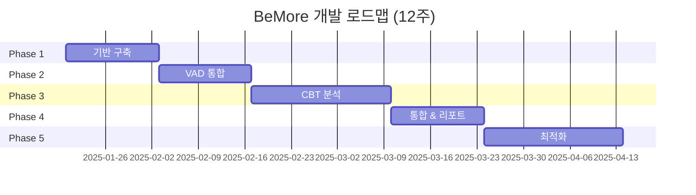

# 🧠 BeMore - AI 기반 심리 상담 지원 시스템

> 실시간 멀티모달 감정 분석을 통한 인지행동치료(CBT) 상담 지원 플랫폼

[](https://github.com/KUS-CapstoneDesign-II/BeMoreBackend)
[](https://nodejs.org/)
[](./LICENSE)

---

## 🎯 프로젝트 소개

**BeMore**는 실시간으로 **얼굴 표정**, **음성 활동**, **대화 내용**을 분석하여 사용자의 심리 상태를 예측하고, **인지행동치료(CBT)** 기반의 치료적 개입을 자동으로 추천하는 AI 상담 지원 시스템입니다.

### **핵심 기능**



---

## ✨ 주요 특징

### **🎭 멀티모달 감정 분석**
- **얼굴 표정**: MediaPipe Face Mesh로 468개 랜드마크 실시간 추출
- **음성 활동**: Silero VAD로 발화 패턴 및 침묵 분석
- **대화 내용**: OpenAI Whisper로 음성을 텍스트로 변환

### **🧠 CBT 인지 왜곡 탐지**
- 10가지 인지 왜곡 유형 자동 탐지 (파국화, 흑백논리, 과일반화 등)
- 소크라테스식 질문 자동 생성
- 행동 과제 추천
- 실시간 치료적 개입 제안

### **📊 실시간 분석 & 리포트**
- 10초 단위 감정 변화 추적
- 세션별 종합 리포트 자동 생성
- 감정 타임라인 시각화
- VAD 메트릭 분석 (발화 속도, 침묵 길이, 발화 빈도)

---

## 🚀 빠른 시작

### **전제 조건**

```bash
# Node.js 18+ 필요
node --version  # v18.0.0 이상

# ffmpeg 설치 (무음 감지용)
# macOS
brew install ffmpeg

# Ubuntu/Debian
sudo apt install ffmpeg
```

### **설치 및 실행**

```bash
# 1. 저장소 클론
git clone https://github.com/KUS-CapstoneDesign-II/BeMoreBackend.git
cd BeMoreBackend

# 2. 의존성 설치
npm install

# 3. 환경 변수 설정
cp .env.example .env
# .env 파일에 API 키 입력
# GEMINI_API_KEY=your_gemini_api_key
# OPENAI_API_KEY=your_openai_api_key

# 4. 개발 서버 실행
npm run dev

# 5. 브라우저 접속
open http://localhost:8000
```

### **환경 변수 (.env)**

```bash
# Google Gemini API
GEMINI_API_KEY=your_gemini_api_key_here

# OpenAI API
OPENAI_API_KEY=your_openai_api_key_here

# 서버 포트
PORT=8000
```

---

## 📁 프로젝트 구조

```
BeMoreBackend/
├── app.js                              # 🚀 서버 진입점
├── package.json                        # 📦 의존성 관리
│
├── docs/                               # 📚 프로젝트 문서
│   ├── README.md                       # 문서 인덱스
│   ├── ARCHITECTURE.md                 # 시스템 아키텍처
│   ├── ROADMAP.md                      # 개발 로드맵
│   └── API.md                          # API 명세서
│
├── public/                             # 🎨 정적 파일
│   └── index.html                      # 테스트용 프론트엔드
│
├── routes/                             # 🛣️ API 라우터
│   └── stt.js                          # STT API 라우터
│
├── services/                           # 🔧 비즈니스 로직
│   ├── socket/
│   │   └── setupLandmarkSocket.js      # WebSocket 핸들러
│   ├── gemini/
│   │   └── gemini.js                   # Gemini 감정 분석
│   └── memory.js                       # STT 버퍼 관리
│
├── face_detector/                      # (사용 안 함)
└── tmp/                                # 임시 오디오 파일
```

---

## 🛠️ 기술 스택

### **Backend**
- **Runtime**: Node.js 18+
- **Framework**: Express 5.1
- **WebSocket**: ws 8.18
- **Media Processing**: ffmpeg

### **AI/ML**
- **감정 분석**: Google Gemini 2.5 Flash
- **음성 변환**: OpenAI Whisper
- **얼굴 추적**: MediaPipe Face Mesh (클라이언트)
- **음성 활동 감지**: Silero VAD (예정)

### **Frontend** (예정)
- **Framework**: React 18 / Next.js 14
- **State**: Context API / Zustand
- **Charts**: Chart.js / Recharts
- **Styling**: Tailwind CSS

---

## 📊 현재 개발 상태 (v0.1.0 - MVP)

### **✅ 구현 완료**

- [x] MediaPipe 실시간 얼굴 랜드마크 추출 (468 points)
- [x] WebSocket으로 1분간 표정 데이터 누적 전송
- [x] OpenAI Whisper STT 음성 변환 (5초 단위)
- [x] ffmpeg 무음 감지로 API 호출 최적화
- [x] Gemini로 표정+STT 통합 분석
- [x] 1분 주기 감정 분석 결과 반환
- [x] 중복 녹음 방지 로직

### **🚧 진행 중**

- [ ] 세션 관리 시스템 (시작/일시정지/종료)
- [ ] WebSocket 3채널 분리 (표정/음성/세션)
- [ ] 프론트엔드 통합 (React/Next.js)
- [ ] 10초 단위 분석 (현재 1분 → 10초로 단축)

### **📋 예정**

- [ ] **Phase 2**: VAD 음성 활동 감지 (Silero VAD)
- [ ] **Phase 3**: CBT 인지 왜곡 탐지 및 개입 추천
- [ ] **Phase 4**: 멀티모달 통합 분석 & 리포트 생성
- [ ] **Phase 5**: 성능 최적화, DB 통합, 보안 강화

---

## 🗺️ 개발 로드맵



**상세 로드맵:** [docs/ROADMAP.md](./docs/ROADMAP.md)

---

## 📚 문서

### **전체 문서 목록**

| 문서 | 설명 | 대상 |
|------|------|------|
| [📖 docs/README.md](./docs/README.md) | 문서 인덱스 | 모든 팀원 |
| [🏗️ ARCHITECTURE.md](./docs/ARCHITECTURE.md) | 시스템 아키텍처 | 개발자, 아키텍트 |
| [🗺️ ROADMAP.md](./docs/ROADMAP.md) | 개발 로드맵 | PM, 개발자 |
| [📡 API.md](./docs/API.md) | API 명세서 | 백엔드/프론트엔드 |

### **빠른 링크**

- **처음 시작하는 분**: [ARCHITECTURE.md](./docs/ARCHITECTURE.md) → [ROADMAP.md](./docs/ROADMAP.md)
- **API 구현하는 분**: [API.md](./docs/API.md)
- **프론트엔드 개발자**: [API.md](./docs/API.md) → [ARCHITECTURE.md](./docs/ARCHITECTURE.md)

---

## 🔌 API 미리보기

### **REST API**

```bash
# 세션 시작
POST /api/session/start
{
  "userId": "user_123",
  "counselorId": "counselor_456"
}

# 세션 종료
POST /api/session/:id/end

# 리포트 조회
GET /api/session/:id/report
```

### **WebSocket API**

```javascript
// 3개 채널 연결
const landmarksWs = new WebSocket('ws://localhost:8000/ws/landmarks?sessionId=xxx');
const voiceWs = new WebSocket('ws://localhost:8000/ws/voice?sessionId=xxx');
const sessionWs = new WebSocket('ws://localhost:8000/ws/session?sessionId=xxx');

// 감정 업데이트 수신
landmarksWs.onmessage = (event) => {
  const data = JSON.parse(event.data);
  console.log('현재 감정:', data.emotion); // "불안", "평온" 등
};
```

**상세 API 명세:** [docs/API.md](./docs/API.md)

---

## 🧪 테스트

### **개발 서버 테스트**

```bash
# 서버 실행
npm run dev

# 브라우저에서 테스트 페이지 열기
open http://localhost:8000

# 카메라와 마이크 권한 허용 후 테스트
```

### **API 테스트** (Phase 1 이후)

```bash
# 세션 시작 테스트
curl -X POST http://localhost:8000/api/session/start \
  -H "Content-Type: application/json" \
  -d '{"userId":"user_123","counselorId":"counselor_456"}'

# 세션 조회 테스트
curl http://localhost:8000/api/session/sess_20250117_001
```

---

## 📈 성능 특성

### **데이터 처리량** (1분 상담 기준)

```
얼굴 랜드마크: ~1,200 frames × 468 points = 1.68 MB
STT 요청:      12회 (5초 단위)
VAD 분석:      ~600회 (100ms 단위, Phase 2)
Gemini 요청:   6회 (10초 단위, Phase 1 이후)
```

### **병목 지점**

1. **WebSocket 대역폭**: 1.68 MB/분 → **압축 필요** (468개 → 9개)
2. **Gemini API 응답 시간**: 2-5초 → **캐싱 고려**
3. **Whisper API 호출 빈도**: 12회/분 → **무음 필터 적용 완료**

---

## 🤝 기여 가이드

### **브랜치 전략**

```
main          # 안정 버전
├─ develop    # 개발 브랜치
   ├─ feature/session-management
   ├─ feature/vad-integration
   └─ feature/cbt-analysis
```

### **커밋 컨벤션**

```bash
feat: 새로운 기능 추가
fix: 버그 수정
docs: 문서 수정
refactor: 코드 리팩토링
test: 테스트 코드
chore: 빌드/설정 변경
```

### **이슈 템플릿**

```markdown
## 이슈 유형
- [ ] 버그
- [ ] 기능 요청
- [ ] 문서 개선

## 설명
...

## 재현 방법 (버그인 경우)
1. ...
2. ...
```

---

## 📄 라이선스

이 프로젝트는 MIT 라이선스 하에 배포됩니다. 자세한 내용은 [LICENSE](./LICENSE) 파일을 참조하세요.

---

## 👥 팀

**KUS CapstoneDesign II - BeMore Team**

- **Backend**: 우승재
- **Frontend**: [팀원명]
- **AI/ML**: [팀원명]
- **PM**: [팀원명]

---

## 📞 문의

- **GitHub Issues**: [프로젝트 이슈](https://github.com/KUS-CapstoneDesign-II/BeMoreBackend/issues)
- **Email**: [이메일 주소]
- **문서 질문**: [docs/README.md](./docs/README.md) FAQ 참조

---

## 🙏 감사의 글

이 프로젝트는 다음 오픈소스 프로젝트들의 도움을 받았습니다:

- [MediaPipe](https://google.github.io/mediapipe/) - 얼굴 랜드마크 추출
- [OpenAI Whisper](https://openai.com/research/whisper) - 음성 텍스트 변환
- [Google Gemini](https://ai.google.dev/) - 감정 분석
- [Silero VAD](https://github.com/snakers4/silero-vad) - 음성 활동 감지

---

**마지막 업데이트:** 2025-01-17
**프로젝트 버전:** v0.1.0 (MVP)
**문서 버전:** 1.0.0
