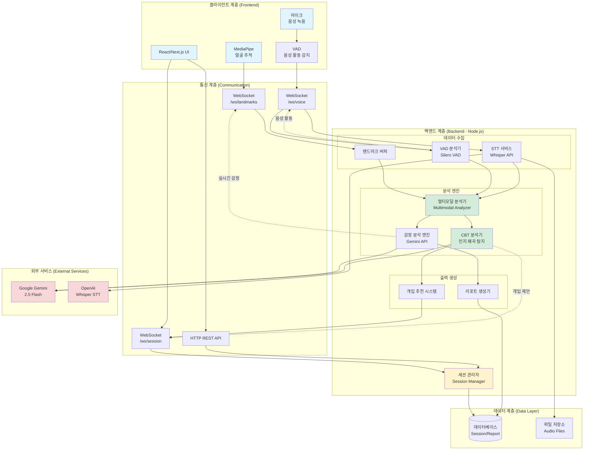
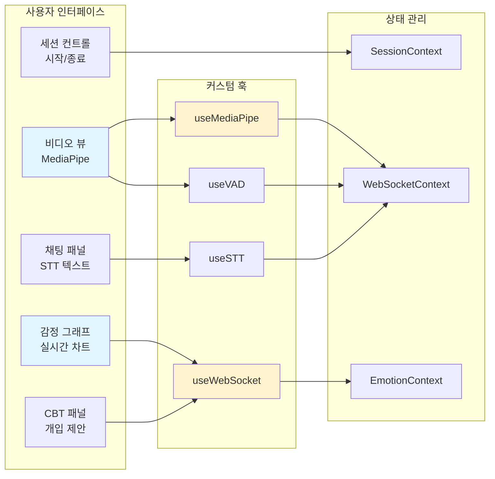
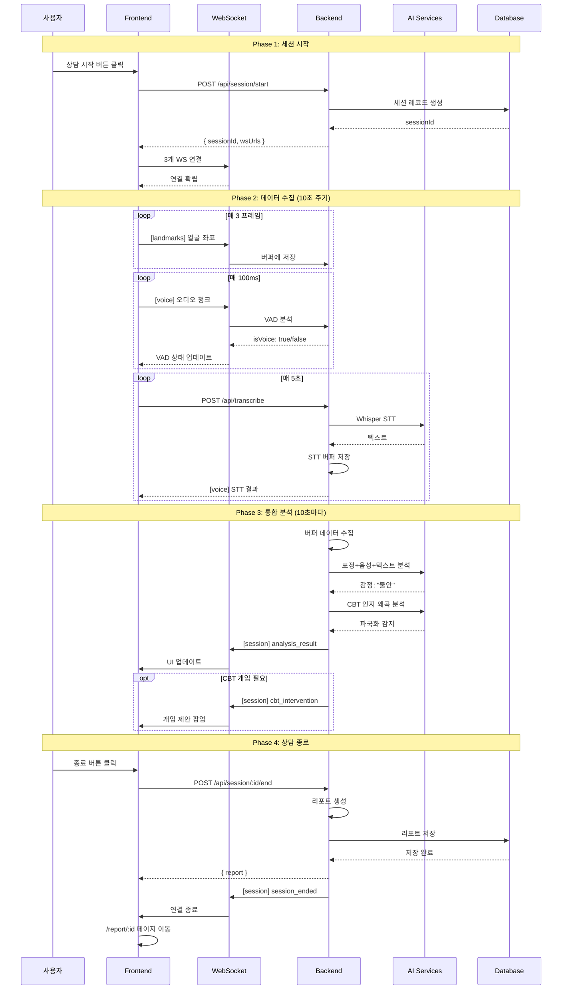
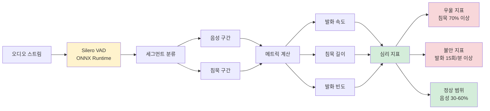
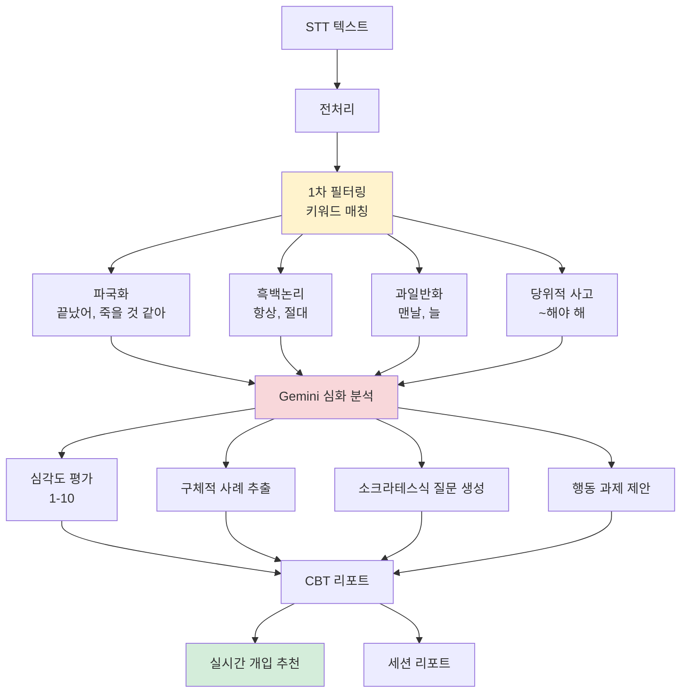
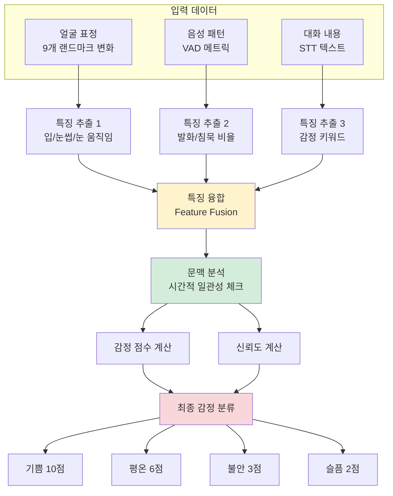
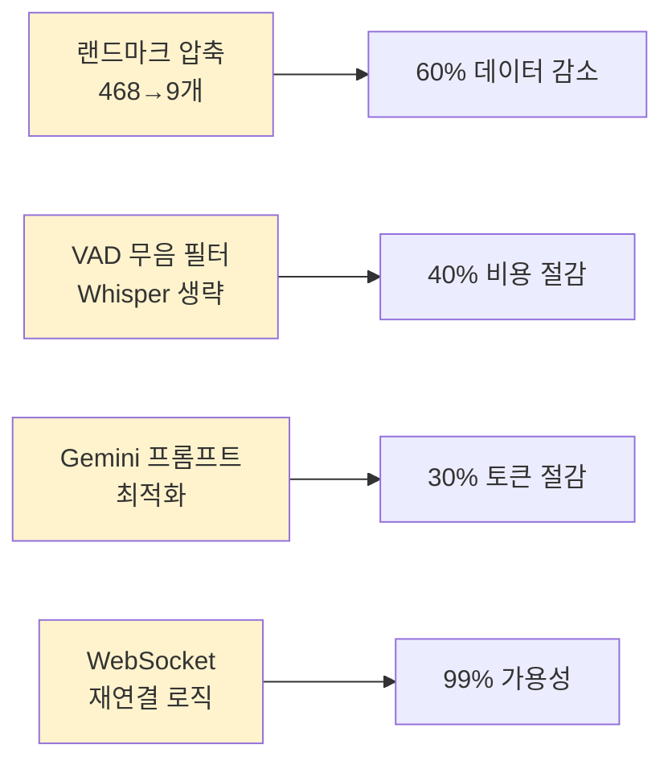
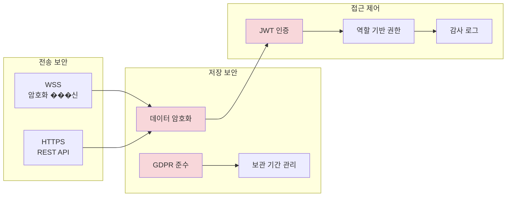
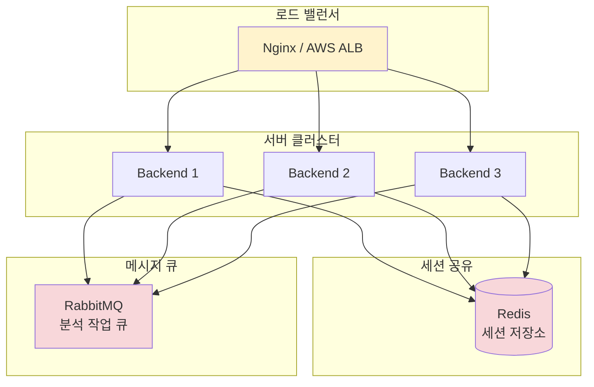
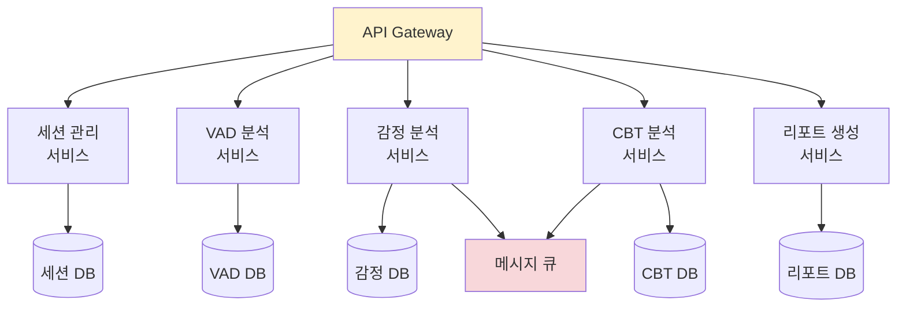

# 🏗️ BeMore 서비스 아키텍처

> 실시간 멀티모달 감정 분석을 통한 AI 기반 심리 상담 지원 시스템

---

## 📋 목차

- [전체 시스템 아키텍처](#전체-시스템-아키텍처)
- [레이어별 상세 구조](#레이어별-상세-구조)
- [데이터 흐름](#데이터-흐름)
- [핵심 컴포넌트](#핵심-컴포넌트)
- [기술 스택](#기술-스택)

---

## 🎯 전체 시스템 아키텍처



---

## 🔄 레이어별 상세 구조

### 1️⃣ **클라이언트 계층 (Frontend)**



**주요 기능:**
- 실시간 얼굴 추적 (MediaPipe Face Mesh 468 points)
- 음성 활동 시각적 표시 (VAD Indicator)
- 감정 변화 그래프 (10초 단위 업데이트)
- STT 텍스트 실시간 표시
- CBT 개입 제안 팝업
- 세션 시작/일시정지/종료 컨트롤

---

### 2️⃣ **백엔드 계층 (Backend)**

```mermaid
graph TB
    subgraph "WebSocket 라우팅"
        WSRouter[WebSocket Router]
        WSRouter --> LandmarksHandler[/ws/landmarks<br/>표정 데이터]
        WSRouter --> VoiceHandler[/ws/voice<br/>음성/VAD]
        WSRouter --> SessionHandler[/ws/session<br/>세션 제어]
    end

    subgraph "세션 관리"
        SessionMgr[Session Manager]
        SessionStore[(세션 저장소)]
        SessionMgr --> SessionStore
    end

    subgraph "분석 파이프라인"
        Buffer[데이터 버퍼]

        Buffer --> Analyzer1[표정 분석기<br/>9개 주요 랜드마크]
        Buffer --> Analyzer2[VAD 분석기<br/>발화 패턴]
        Buffer --> Analyzer3[텍스트 분석기<br/>STT 누적]

        Analyzer1 --> Integration[통합 분석기]
        Analyzer2 --> Integration
        Analyzer3 --> Integration

        Integration --> EmotionAI[감정 AI<br/>Gemini]
        Integration --> CBTAI[CBT AI<br/>인지 왜곡 탐지]

        EmotionAI --> Output[결과 생성]
        CBTAI --> Output

        Output --> Report[리포트]
        Output --> Intervention[실시간 개입]
    end

    LandmarksHandler --> Buffer
    VoiceHandler --> Buffer
    SessionHandler --> SessionMgr

    Intervention -.WebSocket.-> SessionHandler
    Report --> SessionStore

    style WSRouter fill:#fff3cd
    style SessionMgr fill:#fff3cd
    style Integration fill:#d4edda
    style EmotionAI fill:#f8d7da
    style CBTAI fill:#f8d7da
```

**주요 컴포넌트:**

#### **세션 관리자 (Session Manager)**
- 세션 생명주기 관리 (시작/일시정지/재개/종료)
- 고유 세션 ID 생성 및 추적
- 멀티모달 데이터 동기화
- 상담 타임라인 관리

#### **데이터 버퍼**
- 랜드마크 버퍼: 표정 데이터 누적 (10초 단위)
- STT 버퍼: 음성 텍스트 누적
- VAD 버퍼: 음성 활동 세그먼트 추적

#### **분석 엔진**
1. **표정 분석기**: 9개 주요 랜드마크 변화량 계산
2. **VAD 분석기**: 발화 속도/길이/빈도/침묵 패턴 분석
3. **텍스트 분석기**: STT 텍스트 전처리 및 문맥 파악
4. **통합 분석기**: 멀티모달 데이터 융합

#### **AI 엔진**
- **감정 AI**: Gemini로 표정+음성+텍스트 → 감정 분류
- **CBT AI**: 인지 왜곡 10가지 유형 탐지 및 개입 생성

---

### 3️⃣ **데이터 흐름 (상세)**



---

## 🧩 핵심 컴포넌트

### **1. VAD (Voice Activity Detection) 분석기**



**출력 데이터:**
```javascript
{
  voiceRatio: 0.42,              // 음성 비율 42%
  avgSpeechSpeed: 3.2,           // 평균 발화 속도 3.2초
  avgSilenceLength: 5.8,         // 평균 침묵 5.8초
  speechFrequency: 8.3,          // 분당 8.3회 발화
  indicators: {
    depression: false,
    anxiety: false,
    normalSpeech: true
  }
}
```

---

### **2. CBT 분석기 (인지행동치료)**



**인지 왜곡 10가지 유형:**
1. **파국화** (Catastrophizing) - "끝났어", "죽을 것 같아"
2. **흑백논리** (All-or-Nothing) - "항상", "절대", "전혀"
3. **과일반화** (Overgeneralization) - "맨날", "늘", "매번"
4. **감정적 추론** (Emotional Reasoning) - "~것 같아"
5. **독심술** (Mind Reading) - "~할 거야", "~싫어할"
6. **예언적 사고** (Fortune Telling) - "실패할", "안 될"
7. **확대/축소** (Magnification/Minimization)
8. **당위적 사고** (Should Statements) - "~해야 해"
9. **낙인찍기** (Labeling) - "루저", "바보"
10. **개인화** (Personalization) - "내 탓", "내 잘못"

---

### **3. 멀티모달 통합 분석기**



---

## 🛠️ 기술 스택

### **Backend**

| 카테고리 | 기술 | 버전 | 용도 |
|---------|------|------|------|
| **Runtime** | Node.js | 18+ | 서버 실행 환경 |
| **Framework** | Express | 5.1 | HTTP/WebSocket 서버 |
| **WebSocket** | ws | 8.18 | 실시간 양방향 통신 |
| **AI - 감정** | Google Gemini | 2.5 Flash | 감정 분석 & CBT 분석 |
| **AI - STT** | OpenAI Whisper | 1.0 | 음성 텍스트 변환 |
| **VAD** | Silero VAD | ONNX | 음성 활동 감지 |
| **File Upload** | Multer | 2.0 | 오디오 파일 업로드 |
| **Env Config** | dotenv | 17.2 | 환경 변수 관리 |
| **Media Processing** | ffmpeg | - | 음성 무음 감지 |

### **Frontend** (권장)

| 카테고리 | 기술 | 용도 |
|---------|------|------|
| **Framework** | React 18 / Next.js 14 | UI 프레임워크 |
| **State** | Context API / Zustand | 상태 관리 |
| **WebSocket** | Native WebSocket API | 실시간 통신 |
| **Face Tracking** | MediaPipe Face Mesh | 얼굴 랜드마크 추출 |
| **Charts** | Chart.js / Recharts | 감정 그래프 |
| **Styling** | Tailwind CSS | 스타일링 |
| **HTTP Client** | Fetch API / Axios | REST API 호출 |

### **External Services**

| 서비스 | 용도 | 비용 |
|--------|------|------|
| **Google Gemini 2.5 Flash** | 감정 분석, CBT 분석 | $0.000075/1K tokens |
| **OpenAI Whisper** | 음성 텍스트 변환 | $0.006/분 |

### **데이터베이스** (추후 구현)

| 옵션 | 장점 | 추천도 |
|------|------|--------|
| **MongoDB** | 유연한 스키마, 빠른 개발 | ⭐⭐⭐⭐ |
| **PostgreSQL** | 관계형, ACID 보장 | ⭐⭐⭐⭐⭐ |
| **SQLite** | 간단한 설정, 로컬 개발 | ⭐⭐⭐ |

---

## 📊 성능 특성

### **데이터 처리량**

```
1분 상담 기준:
├─ 얼굴 랜드마크: ~1,200 frames × 468 points = 1.68 MB
├─ STT 요청: 12회 (5초 단위)
├─ VAD 분석: ~600회 (100ms 단위)
├─ Gemini 요청: 6회 (10초 단위)
└─ 총 WebSocket 메시지: ~1,800개
```

### **병목 지점**

1. **WebSocket 대역폭**: 1.68 MB/분 (최적화 필요)
2. **Gemini API 응답 시간**: 2-5초 (캐싱 고려)
3. **Whisper API 호출 빈도**: 12회/분 (비용 최적화)
4. **브라우저 메모리**: MediaPipe 메모리 사용량

### **최적화 전략**



---

## 🔐 보안 고려사항

### **데이터 보호**



### **우선순위**

| 항목 | 중요도 | 구현 시기 |
|------|--------|----------|
| WSS 암호화 통신 | 🔴 높음 | Phase 1 |
| 세션 데이터 암호화 | 🟡 중간 | Phase 3 |
| JWT 인증 | 🟡 중간 | Phase 4 |
| GDPR 준수 | 🟢 보통 | Phase 5 |

---

## 🚀 확장성 고려

### **수평 확장 (Horizontal Scaling)**



### **마이크로서비스 전환 (장기)**



---

## 📚 관련 문서

- [개발 로드맵](./ROADMAP.md) - 단계별 구현 계획
- [API 명세서](./API.md) - REST & WebSocket API 상세
- [데이터 모델](./DATA_MODEL.md) - 데이터 구조 정의
- [배포 가이드](./DEPLOYMENT.md) - 배포 및 운영 가이드

---

## ✅ 아키텍처 결정 기록

### **왜 3개의 WebSocket 채널을 분리했는가?**

**이유:**
1. **관심사 분리**: 표정/음성/세션 제어를 독립적으로 관리
2. **확장성**: 각 채널을 독립적으로 스케일링 가능
3. **장애 격리**: 한 채널 장애가 다른 채널에 영향 없음
4. **대역폭 최적화**: 채널별 우선순위 및 QoS 설정 가능

### **왜 Gemini를 선택했는가?**

**비교:**
- **Gemini 2.5 Flash**: 빠른 응답(1-2초), 저렴($0.000075/1K), 한국어 우수
- **GPT-4o**: 높은 정확도, 느린 응답(3-5초), 비쌈($0.005/1K)
- **Custom Model**: 최고 정확도, 개발 비용 높음, 데이터 필요

**결론:** 프로토타입 단계에서는 Gemini가 최적 (속도 + 비용)

### **왜 10초 주기 분석인가?**

**이유:**
1. **실시간성**: 너무 짧으면 노이즈, 너무 길면 지연 발생
2. **비용 효율**: Gemini API 호출 빈도 최적화
3. **사용자 경험**: 10초 간격이면 자연스러운 피드백
4. **데이터 충분성**: 10초면 의미 있는 감정 변화 포착 가능

---

**마지막 업데이트:** 2025-01-17
**문서 버전:** 1.0.0
