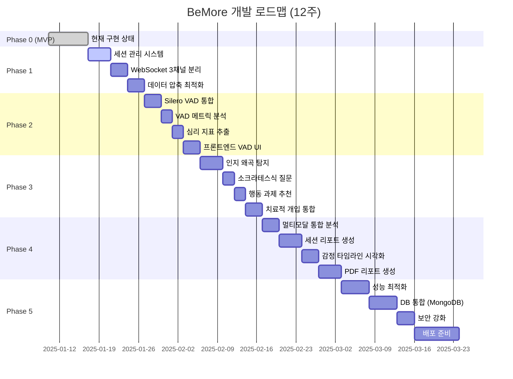

# ✅ BeMore 전체 구현 체크리스트

> **프로젝트 전체 개발 진행 상황 추적**

**작성일**: 2025-01-17
**프로젝트 버전**: v0.1.0 → v1.0.0
**총 예상 소요 시간**: 30-41시간

---

## 📊 전체 진행 상황



**범례**:
- ✅ 완료 (Completed)
- 🔄 진행 중 (In Progress)
- ⏳ 대기 중 (Pending)
- ⚠️ 블로커 (Blocked)

---

## Phase 0: MVP 현재 상태 ✅

### 구현 완료 항목

- [x] **MediaPipe 얼굴 랜드마크 추출**
  - [x] 468개 포인트 실시간 추출
  - [x] 프론트엔드 `public/index.html` 구현
  - [x] WebSocket으로 1분간 누적 전송

- [x] **OpenAI Whisper STT**
  - [x] 5초 단위 음성 변환
  - [x] ffmpeg 무음 감지
  - [x] API 호출 최적화
  - [x] `routes/stt.js` 구현

- [x] **Gemini 감정 분석**
  - [x] 표정 + STT 통합 분석
  - [x] 1분 주기 감정 분석
  - [x] `services/gemini/gemini.js` 구현

- [x] **기본 WebSocket 통신**
  - [x] `/ws` 단일 채널 구현
  - [x] `services/socket/setupLandmarkSocket.js`

### 알려진 제한사항

- [ ] ⚠️ 세션 관리 없음 (일회성 연결만 가능)
- [ ] ⚠️ 60초 분석 주기 (너무 김)
- [ ] ⚠️ 1.68MB/분 대역폭 사용 (과도함)
- [ ] ⚠️ VAD 없음 (음성 활동 감지 불가)
- [ ] ⚠️ CBT 기능 없음 (인지 왜곡 탐지 불가)

---

## Phase 1: 기반 구축 (2주)

### 📚 참고 문서
- **상세 가이드**: [docs/STEP1_GUIDE.md](./STEP1_GUIDE.md)
- **예상 소요**: 8-11시간

### Task 1.1: 세션 관리 시스템 ⏳

**예상 시간**: 3-4시간

- [ ] **SessionManager 클래스 구현**
  - [ ] `services/session/SessionManager.js` 생성
  - [ ] Singleton 패턴 적용
  - [ ] `createSession()` 메서드 구현
  - [ ] `pauseSession()` / `resumeSession()` 구현
  - [ ] `endSession()` 및 리소스 정리

- [ ] **REST API 라우터 구현**
  - [ ] `routes/session.js` 생성
  - [ ] `POST /api/session/start` 엔드포인트
  - [ ] `GET /api/session/:id` 조회
  - [ ] `POST /api/session/:id/pause` 일시정지
  - [ ] `POST /api/session/:id/resume` 재개
  - [ ] `POST /api/session/:id/end` 종료

- [ ] **app.js 통합**
  - [ ] Express 라우터 등록
  - [ ] CORS 설정 확인
  - [ ] 에러 핸들링 미들웨어

- [ ] **테스트**
  - [ ] curl로 세션 생성 테스트
  - [ ] 세션 일시정지/재개 동작 확인
  - [ ] 세션 종료 시 정리 검증

---

### Task 1.2: WebSocket 3채널 분리 ⏳

**예상 시간**: 3-4시간

- [ ] **WebSocket 라우터 구현**
  - [ ] `services/socket/setupWebSockets.js` 생성
  - [ ] URL 기반 라우팅 (`/ws/landmarks`, `/ws/voice`, `/ws/session`)
  - [ ] sessionId 검증 로직

- [ ] **/ws/landmarks 핸들러**
  - [ ] `services/socket/landmarksHandler.js` 생성
  - [ ] 10초 분석 주기로 변경 (60초 → 10초)
  - [ ] 압축된 랜드마크 수신 (9개 포인트)
  - [ ] Gemini 분석 결과 `/ws/session`으로 전송

- [ ] **/ws/voice 핸들러**
  - [ ] `services/socket/voiceHandler.js` 생성 (Phase 2 준비)
  - [ ] 오디오 청크 수신 구조 준비
  - [ ] VAD 통합 대기 상태

- [ ] **/ws/session 핸들러**
  - [ ] `services/socket/sessionHandler.js` 생성
  - [ ] 세션 제어 명령 수신 (pause/resume/end)
  - [ ] 분석 결과 브로드캐스트

- [ ] **테스트 페이지 구현**
  - [ ] `public/test-ws.html` 생성
  - [ ] 3채널 동시 연결 테스트
  - [ ] 세션 제어 버튼 (일시정지/재개/종료)
  - [ ] 실시간 로그 출력

---

### Task 1.3: 데이터 압축 최적화 ⏳

**예상 시간**: 2-3시간

- [ ] **프론트엔드 압축 로직**
  - [ ] `public/index.html` 수정
  - [ ] 468개 → 9개 주요 랜드마크만 전송
  - [ ] KEY_LANDMARK_INDICES 정의
  - [ ] 압축률 94% 확인 (1.68MB → 0.1MB)

- [ ] **백엔드 압축 데이터 처리**
  - [ ] `landmarksHandler.js` 수정
  - [ ] 9개 포인트 검증 로직
  - [ ] Gemini 분석 로직 업데이트

- [ ] **Gemini 프롬프트 조정**
  - [ ] `services/gemini/gemini.js` 수정
  - [ ] 9개 포인트 기반 분석 프롬프트
  - [ ] 분석 정확도 검증

- [ ] **성능 테스트**
  - [ ] 네트워크 사용량 측정 (before/after)
  - [ ] 분석 정확도 비교
  - [ ] 지연시간 측정

---

### Phase 1 완료 조건

- [ ] ✅ 세션 생성/조회/일시정지/재개/종료 모두 동작
- [ ] ✅ 3채널 WebSocket 독립적으로 연결됨
- [ ] ✅ 10초마다 감정 분석 결과 수신
- [ ] ✅ 대역폭 사용량 1.68MB → 0.1MB 감소
- [ ] ✅ `test-ws.html`에서 모든 기능 정상 작동

---

## Phase 2: VAD 통합 (2주)

### 📚 참고 문서
- **상세 가이드**: [docs/STEP2_GUIDE.md](./STEP2_GUIDE.md)
- **예상 소요**: 10-14시간

### Task 2.1: Silero VAD 통합 ⏳

**예상 시간**: 3-4시간

- [ ] **의존성 설치**
  - [ ] `npm install @ricky0123/vad-node`
  - [ ] `npm install @ricky0123/vad-web` (프론트엔드)
  - [ ] `npm install wav-encoder audio-buffer-utils`

- [ ] **VAD Analyzer 클래스**
  - [ ] `services/vad/VadAnalyzer.js` 생성
  - [ ] Silero VAD 모델 로딩 (2-3초)
  - [ ] `analyzeChunk()` 메서드 (100ms 단위)
  - [ ] Singleton 패턴 적용

- [ ] **Voice Handler 업데이트**
  - [ ] `services/socket/voiceHandler.js` 완전 구현
  - [ ] 100ms 오디오 청크 수신
  - [ ] VAD 분석 결과 메트릭 수집
  - [ ] 10초마다 통계 계산

- [ ] **환경 변수 설정**
  - [ ] `.env`에 VAD 설정 추가
  - [ ] VAD_SAMPLE_RATE, VAD_THRESHOLD 조정

---

### Task 2.2: VAD 메트릭 분석 ⏳

**예상 시간**: 2-3시간

- [ ] **VAD Metrics 클래스**
  - [ ] `services/vad/VadMetrics.js` 생성
  - [ ] 발화/침묵 이벤트 수집
  - [ ] `calculateMetrics()` 구현 (7가지 메트릭)
  - [ ] 세그먼트 추출 로직 (`_extractSegments`)

- [ ] **메트릭 종류 구현**
  - [ ] speechRate (발화 비율 %)
  - [ ] silenceRate (침묵 비율 %)
  - [ ] avgSpeechDuration (평균 발화 길이 ms)
  - [ ] avgSilenceDuration (평균 침묵 길이 ms)
  - [ ] maxSilenceDuration (최대 침묵 길이 ms)
  - [ ] speechFrequency (발화 빈도 /분)
  - [ ] avgProbability (VAD 확률 평균)

- [ ] **통계 라이브러리 통합**
  - [ ] `npm install simple-statistics`
  - [ ] 평균, 표준편차 계산

---

### Task 2.3: 심리 지표 추출 ⏳

**예상 시간**: 2-3시간

- [ ] **Psychological Indicators 모듈**
  - [ ] `services/vad/PsychologicalIndicators.js` 생성
  - [ ] `extractPsychologicalIndicators()` 함수

- [ ] **5가지 심리 지표 구현**
  - [ ] prolonged_silence (긴 침묵 → 우울)
  - [ ] high_silence_rate (높은 침묵 비율 → 위축)
  - [ ] low_speech_frequency (낮은 발화 빈도 → 무기력)
  - [ ] short_speech_segments (짧은 발화 → 회피)
  - [ ] low_voice_energy (낮은 음성 에너지 → 피로)

- [ ] **임계값 설정**
  - [ ] `.env`에 임계값 추가
  - [ ] SILENCE_THRESHOLD_MS (3000ms)
  - [ ] FAST_SPEECH_THRESHOLD (180 wpm)
  - [ ] SLOW_SPEECH_THRESHOLD (90 wpm)

- [ ] **심각도 계산**
  - [ ] low/medium/high 자동 분류
  - [ ] 정규화 점수 (0-1)

---

### Task 2.4: 프론트엔드 VAD UI ⏳

**예상 시간**: 2-3시간

- [ ] **VAD 테스트 페이지**
  - [ ] `public/vad-test.html` 생성
  - [ ] 마이크 권한 요청 UI
  - [ ] AudioContext 설정 (16kHz)

- [ ] **오디오 캡처 로직**
  - [ ] ScriptProcessor 생성 (100ms 청크)
  - [ ] Float32Array → Array 변환
  - [ ] `/ws/voice`로 전송

- [ ] **실시간 VAD 상태 표시**
  - [ ] 🗣️ 발화 중 / 🤐 침묵 UI
  - [ ] VAD 확률 실시간 업데이트
  - [ ] 10초 메트릭 패널

- [ ] **심리 지표 UI**
  - [ ] 감지된 지표 카드 표시
  - [ ] 심각도별 색상 구분
  - [ ] 심리적 의미 툴팁

---

### Task 2.5: Gemini 멀티모달 통합 ⏳

**예상 시간**: 1-2시간

- [ ] **gemini.js 확장**
  - [ ] `analyzeExpression()` 파라미터 추가
  - [ ] vadMetrics, psychoIndicators 포함
  - [ ] 프롬프트 업데이트 (VAD 데이터 반영)

- [ ] **통합 테스트**
  - [ ] 표정 + 음성 + STT 통합 분석
  - [ ] 우울 시뮬레이션 (긴 침묵)
  - [ ] 불안 시뮬레이션 (빠른 발화)

---

### Phase 2 완료 조건

- [ ] ✅ Silero VAD 모델 로딩 성공 (2-3초)
- [ ] ✅ 100ms 청크 실시간 분석
- [ ] ✅ 10초마다 7가지 메트릭 계산
- [ ] ✅ 5가지 심리 지표 자동 탐지
- [ ] ✅ `vad-test.html`에서 모든 기능 동작
- [ ] ✅ Gemini 프롬프트에 VAD 데이터 포함

---

## Phase 3: CBT 분석 (2-3주)

### 📚 참고 문서
- **상세 가이드**: [docs/STEP3_GUIDE.md](./STEP3_GUIDE.md)
- **예상 소요**: 12-16시간

### Task 3.1: 인지 왜곡 탐지 시스템 ⏳

**예상 시간**: 4-5시간

- [ ] **패턴 데이터베이스 생성**
  - [ ] `services/cbt/patterns/` 디렉토리 생성
  - [ ] 10개 JSON 패턴 파일 작성:
    - [ ] catastrophizing.json (파국화)
    - [ ] all-or-nothing.json (흑백논리)
    - [ ] overgeneralization.json (과일반화)
    - [ ] mental-filter.json (정신적 여과)
    - [ ] disqualifying-positive.json (긍정 부인)
    - [ ] jumping-to-conclusions.json (성급한 결론)
    - [ ] magnification.json (확대/축소)
    - [ ] emotional-reasoning.json (감정적 추론)
    - [ ] should-statements.json (당위적 사고)
    - [ ] labeling.json (낙인찍기)

- [ ] **CognitiveDistortionDetector 클래스**
  - [ ] `services/cbt/CognitiveDistortionDetector.js` 생성
  - [ ] 패턴 로딩 (`_loadPatterns()`)
  - [ ] `detectDistortions()` 메서드
  - [ ] 키워드 + Regex 2단계 매칭
  - [ ] 심각도 계산 (high/medium/low)

- [ ] **한국어 정규표현식 최적화**
  - [ ] 띄어쓰기 변형 허용
  - [ ] 조사 변형 처리
  - [ ] 키워드 확장

- [ ] **테스트**
  - [ ] `test-cbt.js` 스크립트 작성
  - [ ] 10가지 왜곡 탐지 정확도 검증

---

### Task 3.2: 소크라테스식 질문 생성 ⏳

**예상 시간**: 2-3시간

- [ ] **SocraticQuestioner 클래스**
  - [ ] `services/cbt/SocraticQuestioner.js` 생성
  - [ ] `generateQuestions()` 메서드
  - [ ] Gemini API 통합

- [ ] **프롬프트 엔지니어링**
  - [ ] 5가지 원칙 반영 (증거/대안/결과/경험/타인)
  - [ ] 비판 금지, 호기심 어린 톤
  - [ ] 한국어 출력 포맷 최적화

- [ ] **폴백 메커니즘**
  - [ ] `_getFallbackQuestions()` 구현
  - [ ] 10가지 왜곡별 사전 정의 질문
  - [ ] Gemini 실패 시 자동 폴백

- [ ] **테스트**
  - [ ] `test-socratic.js` 스크립트
  - [ ] 질문 품질 평가 (명확성, 비판 없음, 유도성)

---

### Task 3.3: 행동 과제 추천 ⏳

**예상 시간**: 2-3시간

- [ ] **BehavioralTaskRecommender 클래스**
  - [ ] `services/cbt/BehavioralTaskRecommender.js` 생성
  - [ ] `recommendTasks()` 메서드
  - [ ] Gemini API 통합

- [ ] **과제 생성 원칙**
  - [ ] 구체적, 측정 가능
  - [ ] 점진적 (작은 단계)
  - [ ] 안전함, 일상적
  - [ ] 기록 권장

- [ ] **폴백 과제**
  - [ ] 10가지 왜곡별 기본 과제 작성
  - [ ] 제목, 설명, 기대효과 포맷

- [ ] **테스트**
  - [ ] 과제 실행 가능성 검증
  - [ ] 내담자 부담 수준 평가

---

### Task 3.4: 치료적 개입 통합 ⏳

**예상 시간**: 3-4시간

- [ ] **InterventionGenerator 클래스**
  - [ ] `services/cbt/InterventionGenerator.js` 생성
  - [ ] `analyzeAndIntervene()` 메서드
  - [ ] 왜곡 히스토리 관리 (Map)

- [ ] **개입 조건 로직**
  - [ ] 심각도 high → 즉시 개입
  - [ ] 같은 왜곡 3회 반복 → 개입
  - [ ] 다양한 왜곡 동시 발생 → 개입

- [ ] **gemini.js 확장**
  - [ ] CBT 개입 포함한 프롬프트
  - [ ] `cbtIntervention` 필드 추가
  - [ ] 분석 결과 반환 포맷 변경

- [ ] **WebSocket 핸들러 통합**
  - [ ] `landmarksHandler.js` 수정
  - [ ] 10초마다 CBT 분석
  - [ ] `/ws/session`으로 개입 전송

- [ ] **프론트엔드 UI**
  - [ ] `public/cbt-test.html` 생성
  - [ ] 개입 카드 표시
  - [ ] 질문 + 과제 UI

---

### Phase 3 완료 조건

- [ ] ✅ 10가지 인지 왜곡 탐지 정확도 ≥80%
- [ ] ✅ 소크라테스식 질문 생성 (3-5개)
- [ ] ✅ 행동 과제 추천 (2-3개)
- [ ] ✅ 개입 조건 로직 정상 작동
- [ ] ✅ Gemini 멀티모달 분석 (표정+음성+STT+CBT)
- [ ] ✅ `cbt-test.html`에서 모든 기능 동작

---

## Phase 4: 통합 분석 & 리포트 (2주)

### 📚 참고 문서
- **상세 가이드**: `docs/STEP4_GUIDE.md` (작성 예정)
- **예상 소요**: 14-18시간

### Task 4.1: 멀티모달 통합 분석 엔진 ⏳

**예상 시간**: 3-4시간

- [ ] **통합 분석 서비스**
  - [ ] `services/analysis/MultimodalAnalyzer.js` 생성
  - [ ] 표정 + 음성 + STT + CBT 통합
  - [ ] 가중치 기반 최종 감정 계산
  - [ ] 신뢰도 점수 산출

- [ ] **컨텍스트 윈도우 관리**
  - [ ] 시간별 데이터 슬라이싱
  - [ ] 최근 10초, 1분, 5분 컨텍스트
  - [ ] 메모리 최적화 (순환 버퍼)

---

### Task 4.2: 세션 리포트 생성 ⏳

**예상 시간**: 4-5시간

- [ ] **ReportGenerator 클래스**
  - [ ] `services/report/ReportGenerator.js` 생성
  - [ ] `generateSessionReport()` 메서드
  - [ ] 세션 요약 통계

- [ ] **리포트 구성 요소**
  - [ ] 세션 메타데이터 (시간, 참여자)
  - [ ] 감정 타임라인 (10초 단위)
  - [ ] VAD 메트릭 요약
  - [ ] 탐지된 인지 왜곡 목록
  - [ ] 제공된 개입 목록
  - [ ] 권장 사항 (다음 세션)

- [ ] **API 엔드포인트**
  - [ ] `GET /api/session/:id/report` 구현
  - [ ] JSON 형식 리포트 반환
  - [ ] 캐싱 적용 (세션 종료 후)

---

### Task 4.3: 감정 타임라인 시각화 ⏳

**예상 시간**: 3-4시간

- [ ] **프론트엔드 차트 라이브러리**
  - [ ] Chart.js 또는 Recharts 설치
  - [ ] `public/report.html` 생성

- [ ] **타임라인 그래프**
  - [ ] X축: 시간 (10초 단위)
  - [ ] Y축: 감정 강도 (0-1)
  - [ ] 색상: 감정별 구분 (불안=빨강, 평온=파랑)

- [ ] **VAD 메트릭 차트**
  - [ ] 발화/침묵 비율 파이 차트
  - [ ] 침묵 길이 히스토그램
  - [ ] 발화 빈도 선 그래프

- [ ] **인지 왜곡 분포**
  - [ ] 왜곡 유형별 막대 그래프
  - [ ] 심각도별 색상 구분

---

### Task 4.4: PDF 리포트 생성 ⏳

**예상 시간**: 4-5시간

- [ ] **PDF 라이브러리 통합**
  - [ ] `npm install pdfkit`
  - [ ] `services/report/PdfGenerator.js` 생성

- [ ] **PDF 템플릿 디자인**
  - [ ] 커버 페이지 (로고, 세션 정보)
  - [ ] 감정 타임라인 (Chart.js → Canvas → PDF)
  - [ ] VAD 메트릭 테이블
  - [ ] 인지 왜곡 요약
  - [ ] 제공된 질문 및 과제
  - [ ] 권장 사항

- [ ] **API 엔드포인트**
  - [ ] `GET /api/session/:id/report/pdf` 구현
  - [ ] Content-Type: application/pdf
  - [ ] 다운로드 파일명 자동 생성

---

### Phase 4 완료 조건

- [ ] ✅ 멀티모달 통합 분석 정확도 ≥85%
- [ ] ✅ JSON 리포트 생성 (<2초)
- [ ] ✅ 감정 타임라인 그래프 정상 렌더링
- [ ] ✅ PDF 리포트 생성 (<5초)
- [ ] ✅ `report.html`에서 리포트 조회 가능

---

## Phase 5: 최적화 & 고도화 (2-3주)

### 📚 참고 문서
- **상세 가이드**: `docs/STEP5_GUIDE.md` (작성 예정)
- **예상 소요**: 21-28시간

### Task 5.1: 성능 최적화 ⏳

**예상 시간**: 5-7시간

- [ ] **메모리 최적화**
  - [ ] 순환 버퍼로 세션 데이터 관리
  - [ ] 오래된 데이터 자동 정리 (>1시간)
  - [ ] 메모리 프로파일링 (Chrome DevTools)

- [ ] **응답 시간 최적화**
  - [ ] Gemini API 캐싱 (같은 입력)
  - [ ] 병렬 처리 (Promise.all)
  - [ ] 데이터베이스 인덱싱 (Phase 5.2 후)

- [ ] **네트워크 최적화**
  - [ ] WebSocket 메시지 압축 (zlib)
  - [ ] 청크 크기 최적화 (100ms vs 200ms)

- [ ] **성능 테스트**
  - [ ] 동시 접속 100명 부하 테스트
  - [ ] 메모리 누수 확인 (24시간 실행)
  - [ ] CPU 사용률 모니터링

---

### Task 5.2: DB 통합 (MongoDB) ⏳

**예상 시간**: 5-7시간

- [ ] **MongoDB 설정**
  - [ ] `npm install mongodb mongoose`
  - [ ] MongoDB Atlas 계정 생성
  - [ ] 연결 문자열 `.env`에 추가

- [ ] **스키마 정의**
  - [ ] `models/Session.js` (세션 정보)
  - [ ] `models/EmotionRecord.js` (감정 타임라인)
  - [ ] `models/CbtIntervention.js` (개입 기록)
  - [ ] `models/User.js` (사용자 정보)

- [ ] **SessionManager 수정**
  - [ ] 세션 생성 시 DB 저장
  - [ ] 세션 종료 시 DB 업데이트
  - [ ] 과거 세션 조회 API

- [ ] **리포트 영구 저장**
  - [ ] 세션 종료 시 리포트 DB 저장
  - [ ] PDF 파일 S3/Google Cloud 저장 (선택)

---

### Task 5.3: 보안 강화 ⏳

**예상 시간**: 3-4시간

- [ ] **인증/인가**
  - [ ] JWT 기반 인증 구현
  - [ ] `POST /api/auth/login` 엔드포인트
  - [ ] 세션 생성 시 사용자 검증
  - [ ] WebSocket 연결 시 토큰 검증

- [ ] **HTTPS 적용**
  - [ ] SSL 인증서 발급 (Let's Encrypt)
  - [ ] Express HTTPS 서버 설정
  - [ ] WSS (WebSocket Secure) 적용

- [ ] **Rate Limiting**
  - [ ] `npm install express-rate-limit`
  - [ ] API 호출 제한 (100회/15분)
  - [ ] WebSocket 연결 제한 (5개/IP)

- [ ] **데이터 암호화**
  - [ ] 민감 정보 암호화 (AES-256)
  - [ ] DB 전송 시 TLS 적용
  - [ ] 환경 변수 암호화 (dotenv-vault)

---

### Task 5.4: 배포 준비 ⏳

**예상 시간**: 8-10시간

- [ ] **Docker 컨테이너화**
  - [ ] `Dockerfile` 작성
  - [ ] `docker-compose.yml` (앱 + MongoDB)
  - [ ] 이미지 빌드 및 테스트

- [ ] **CI/CD 파이프라인**
  - [ ] GitHub Actions 워크플로우 작성
  - [ ] 자동 테스트 (Jest)
  - [ ] 자동 배포 (Heroku/AWS)

- [ ] **모니터링 설정**
  - [ ] Winston 로그 라이브러리
  - [ ] PM2 프로세스 관리자
  - [ ] Sentry 에러 트래킹
  - [ ] Prometheus + Grafana 메트릭

- [ ] **문서 정리**
  - [ ] API 문서 Swagger 생성
  - [ ] 배포 가이드 작성
  - [ ] 환경 변수 템플릿 (`.env.example`)

---

### Phase 5 완료 조건

- [ ] ✅ 동시 접속 100명 부하 테스트 통과
- [ ] ✅ MongoDB 세션 영구 저장
- [ ] ✅ JWT 인증 정상 작동
- [ ] ✅ HTTPS/WSS 적용
- [ ] ✅ Docker 컨테이너 실행 성공
- [ ] ✅ CI/CD 파이프라인 구축
- [ ] ✅ 프로덕션 배포 완료

---

## 📝 전체 완료 조건

### 기능 요구사항

- [ ] ✅ 세션 관리 (생성/일시정지/재개/종료)
- [ ] ✅ 3채널 WebSocket 통신
- [ ] ✅ 10초 단위 감정 분석
- [ ] ✅ VAD 음성 활동 감지
- [ ] ✅ 10가지 인지 왜곡 탐지
- [ ] ✅ 소크라테스식 질문 생성
- [ ] ✅ 행동 과제 추천
- [ ] ✅ 세션 리포트 생성 (JSON/PDF)

### 성능 요구사항

- [ ] ✅ 감정 분석 응답 시간 <3초
- [ ] ✅ WebSocket 지연 시간 <100ms
- [ ] ✅ 대역폭 사용량 <0.2MB/분
- [ ] ✅ 동시 접속 100명 지원
- [ ] ✅ 메모리 사용량 <500MB/세션

### 품질 요구사항

- [ ] ✅ 인지 왜곡 탐지 정확도 ≥80%
- [ ] ✅ 감정 분석 정확도 ≥85%
- [ ] ✅ VAD 정확도 ≥90%
- [ ] ✅ 테스트 커버리지 ≥70%
- [ ] ✅ 에러율 <1%

---

## 📈 진행 상황 추적

### 주간 체크인

**매주 금요일 17:00**: 진행 상황 점검 및 다음 주 계획

```markdown
## Week [N] 체크인 (2025-MM-DD)

### 완료 항목
- [ ] Task X.X: [Task 이름]
- [ ] ...

### 블로커 및 이슈
- ⚠️ [문제 설명]
- 해결 방법: [계획]

### 다음 주 목표
- [ ] Task Y.Y: [Task 이름]
- [ ] ...

### 시간 소요
- 예상: XX시간
- 실제: YY시간
- 차이: ±ZZ시간
```

---

## 🚀 마일스톤

| 마일스톤 | 날짜 (예상) | 상태 |
|----------|-------------|------|
| **M1: MVP 완료** | 2025-01-17 | ✅ 완료 |
| **M2: Phase 1 완료** | 2025-01-31 | ⏳ 대기 |
| **M3: Phase 2 완료** | 2025-02-14 | ⏳ 대기 |
| **M4: Phase 3 완료** | 2025-03-07 | ⏳ 대기 |
| **M5: Phase 4 완료** | 2025-03-21 | ⏳ 대기 |
| **M6: Phase 5 완료** | 2025-04-18 | ⏳ 대기 |
| **M7: 프로덕션 배포** | 2025-04-25 | ⏳ 대기 |

---

## 📞 문의 및 지원

- **GitHub Issues**: [프로젝트 이슈](https://github.com/KUS-CapstoneDesign-II/BeMoreBackend/issues)
- **문서**: [docs/README.md](./README.md)
- **가이드**: [STEP1_GUIDE.md](./STEP1_GUIDE.md), [STEP2_GUIDE.md](./STEP2_GUIDE.md), [STEP3_GUIDE.md](./STEP3_GUIDE.md)

---

**마지막 업데이트**: 2025-01-17
**문서 버전**: 1.0.0
**관리자**: BeMore 개발팀
