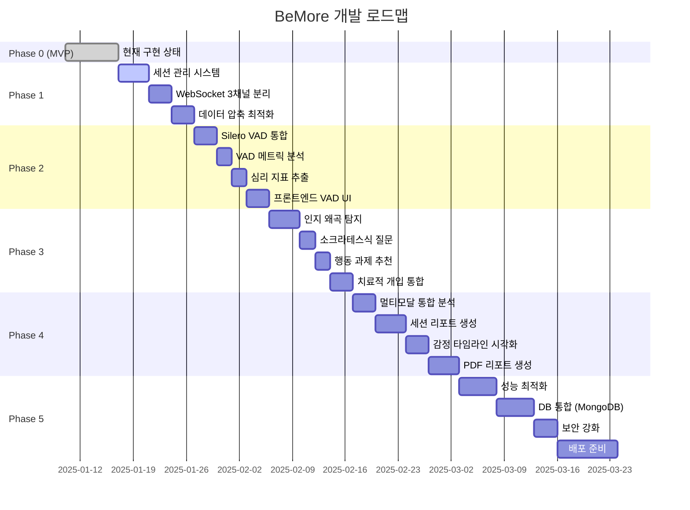

# 📘 BeMore 전체 구현 가이드

> **BeMore 프로젝트 통합 구현 문서**
>
> AI 기반 감정 분석 및 CBT 상담 시스템 구현 가이드

**작성일**: 2025-01-17
**프로젝트 버전**: v0.1.0 → v1.0.0
**총 예상 소요 시간**: 30-41시간

---

## 📋 목차

1. [프로젝트 개요](#프로젝트-개요)
2. [전체 진행 상황](#전체-진행-상황)
3. [Phase 0: MVP 현재 상태](#phase-0-mvp-현재-상태)
4. [Phase 1: 기반 구축 (1-2주)](#phase-1-기반-구축-1-2주)
5. [Phase 2: VAD 통합 (2주)](#phase-2-vad-통합-2주)
6. [Phase 3: CBT 분석 (2-3주)](#phase-3-cbt-분석-2-3주)
7. [Phase 4: 통합 분석 & 리포트 (2주)](#phase-4-통합-분석--리포트-2주)
8. [Phase 5: 최적화 & 고도화 (2-3주)](#phase-5-최적화--고도화-2-3주)
9. [전체 완료 조건](#전체-완료-조건)
10. [트러블슈팅](#트러블슈팅)

---

## 프로젝트 개요

### 시스템 아키텍처

```mermaid
graph TB
    subgraph "클라이언트"
        A[웹캠/마이크] --> B[MediaPipe]
        A --> C[오디오 처리]
        B --> D[얼굴 랜드마크]
        C --> E[VAD 분석]
    end

    subgraph "WebSocket 통신"
        D --> F[/ws/landmarks]
        E --> G[/ws/voice]
        H[세션 제어] --> I[/ws/session]
    end

    subgraph "분석 엔진"
        F --> J[Gemini 멀티모달]
        G --> J
        K[STT] --> J
        J --> L[감정 분석]
    end

    subgraph "CBT 엔진"
        L --> M[인지 왜곡 탐지]
        M --> N[소크라테스식 질문]
        M --> O[행동 과제 추천]
    end

    subgraph "결과 출력"
        N --> P[실시간 개입]
        O --> P
        P --> I
    end
```

---

## 전체 진행 상황

### 개발 로드맵 (12주)



### 마일스톤

| 마일스톤 | 날짜 (예상) | 상태 |
|----------|-------------|------|
| **M1: MVP 완료** | 2025-01-17 | ✅ 완료 |
| **M2: Phase 1 완료** | 2025-01-31 | ⏳ 대기 |
| **M3: Phase 2 완료** | 2025-02-14 | ⏳ 대기 |
| **M4: Phase 3 완료** | 2025-03-07 | ⏳ 대기 |
| **M5: Phase 4 완료** | 2025-03-21 | ⏳ 대기 |
| **M6: Phase 5 완료** | 2025-04-18 | ⏳ 대기 |
| **M7: 프로덕션 배포** | 2025-04-25 | ⏳ 대기 |

---

## Phase 0: MVP 현재 상태

### 구현 완료 항목

- [x] **MediaPipe 얼굴 랜드마크 추출**
  - 468개 포인트 실시간 추출
  - 프론트엔드 `public/index.html` 구현
  - WebSocket으로 1분간 누적 전송

- [x] **OpenAI Whisper STT**
  - 5초 단위 음성 변환
  - ffmpeg 무음 감지
  - API 호출 최적화

- [x] **Gemini 감정 분석**
  - 표정 + STT 통합 분석
  - 1분 주기 감정 분석

- [x] **기본 WebSocket 통신**
  - `/ws` 단일 채널 구현

### 알려진 제한사항

- [ ] ⚠️ 세션 관리 없음 (일회성 연결만 가능)
- [ ] ⚠️ 60초 분석 주기 (너무 김)
- [ ] ⚠️ 1.68MB/분 대역폭 사용 (과도함)
- [ ] ⚠️ VAD 없음 (음성 활동 감지 불가)
- [ ] ⚠️ CBT 기능 없음 (인지 왜곡 탐지 불가)

---

## Phase 1: 기반 구축 (1-2주)

> **목표**: 현재 시스템을 안정적이고 확장 가능하게 만들기
> **예상 소요**: 8-11시간
> **난이도**: ⭐⭐⭐ (중급)

### 개요

**현재 문제점**:
- ❌ 세션 관리 없음 → 누가 접속했는지 추적 불가
- ❌ 단일 WebSocket → 표정/음성/제어 데이터 혼재
- ❌ 1분 분석 주기 → 너무 느린 피드백
- ❌ 468개 랜드마크 전송 → 대역폭 낭비

**Phase 1 완료 후**:
- ✅ 세션 시작/종료 추적 가능
- ✅ 3개 독립 WebSocket 채널
- ✅ 10초 분석 주기 → 6배 빠른 피드백
- ✅ 9개 주요 랜드마크만 전송 → 94% 대역폭 절감

### 사전 준비

```bash
# 1. Node.js 버전 확인 (18+ 필요)
node --version

# 2. UUID 패키지 설치
npm install uuid

# 3. 디렉토리 생성
mkdir -p services/session
mkdir -p services/socket
mkdir -p routes
```

### Task 1.1: 세션 관리 시스템 (3-4시간)

#### 파일 생성: `services/session/SessionManager.js`

<details>
<summary>코드 보기</summary>

```javascript
const { v4: uuidv4 } = require('uuid');

class SessionManager {
  constructor() {
    this.sessions = new Map();
    console.log('✅ SessionManager 초기화');
  }

  createSession({ userId, counselorId }) {
    const timestamp = Date.now();
    const randomId = uuidv4().slice(0, 8);
    const sessionId = `sess_${timestamp}_${randomId}`;

    const session = {
      sessionId,
      userId,
      counselorId,
      status: 'active',
      startedAt: timestamp,
      pausedAt: null,
      resumedAt: null,
      endedAt: null,
      landmarkBuffer: [],
      sttBuffer: [],
      vadBuffer: [],
      emotions: [],
      wsConnections: {
        landmarks: null,
        voice: null,
        session: null
      },
      metadata: {
        clientIP: null,
        userAgent: null,
        deviceType: null
      }
    };

    this.sessions.set(sessionId, session);
    console.log(`✅ 세션 생성: ${sessionId}`);
    return session;
  }

  getSession(sessionId) {
    return this.sessions.get(sessionId);
  }

  pauseSession(sessionId) {
    const session = this.getSession(sessionId);
    if (!session || session.status !== 'active') {
      throw new Error(`활성 세션이 아님: ${sessionId}`);
    }
    session.status = 'paused';
    session.pausedAt = Date.now();
    return session;
  }

  resumeSession(sessionId) {
    const session = this.getSession(sessionId);
    if (!session || session.status !== 'paused') {
      throw new Error(`일시정지 세션이 아님: ${sessionId}`);
    }
    session.status = 'active';
    session.resumedAt = Date.now();
    return session;
  }

  endSession(sessionId) {
    const session = this.getSession(sessionId);
    if (!session) throw new Error(`세션 없음: ${sessionId}`);

    session.status = 'ended';
    session.endedAt = Date.now();

    // WebSocket 연결 종료
    Object.values(session.wsConnections).forEach(ws => {
      if (ws && ws.readyState === 1) {
        ws.close(1000, 'Session ended');
      }
    });

    return session;
  }

  getSessionDuration(sessionId) {
    const session = this.getSession(sessionId);
    if (!session) return 0;
    const endTime = session.endedAt || Date.now();
    return endTime - session.startedAt;
  }
}

const sessionManager = new SessionManager();
module.exports = sessionManager;
```

</details>

#### 파일 생성: `routes/session.js`

<details>
<summary>코드 보기</summary>

```javascript
const express = require('express');
const router = express.Router();
const SessionManager = require('../services/session/SessionManager');

// 세션 시작
router.post('/start', (req, res) => {
  const { userId, counselorId } = req.body;

  if (!userId || !counselorId) {
    return res.status(400).json({
      success: false,
      error: { message: 'userId와 counselorId 필요' }
    });
  }

  const session = SessionManager.createSession({ userId, counselorId });
  const baseUrl = `ws://${req.get('host')}`;

  res.json({
    success: true,
    data: {
      sessionId: session.sessionId,
      wsUrls: {
        landmarks: `${baseUrl}/ws/landmarks?sessionId=${session.sessionId}`,
        voice: `${baseUrl}/ws/voice?sessionId=${session.sessionId}`,
        session: `${baseUrl}/ws/session?sessionId=${session.sessionId}`
      },
      startedAt: session.startedAt,
      status: session.status
    }
  });
});

// 세션 조회
router.get('/:id', (req, res) => {
  const session = SessionManager.getSession(req.params.id);
  if (!session) {
    return res.status(404).json({ success: false, error: { message: '세션 없음' } });
  }
  res.json({ success: true, data: session });
});

// 세션 일시정지
router.post('/:id/pause', (req, res) => {
  try {
    const session = SessionManager.pauseSession(req.params.id);
    res.json({ success: true, data: session });
  } catch (err) {
    res.status(404).json({ success: false, error: { message: err.message } });
  }
});

// 세션 재개
router.post('/:id/resume', (req, res) => {
  try {
    const session = SessionManager.resumeSession(req.params.id);
    res.json({ success: true, data: session });
  } catch (err) {
    res.status(404).json({ success: false, error: { message: err.message } });
  }
});

// 세션 종료
router.post('/:id/end', (req, res) => {
  try {
    const session = SessionManager.endSession(req.params.id);
    res.json({ success: true, data: session });
  } catch (err) {
    res.status(404).json({ success: false, error: { message: err.message } });
  }
});

module.exports = router;
```

</details>

### Task 1.2: WebSocket 3채널 분리 (3-4시간)

#### 파일 생성: `services/socket/setupWebSockets.js`

<details>
<summary>코드 보기</summary>

```javascript
const url = require('url');
const SessionManager = require('../session/SessionManager');
const { handleLandmarks } = require('./landmarksHandler');
const { handleVoice } = require('./voiceHandler');
const { handleSession } = require('./sessionHandler');

function setupWebSockets(wss) {
  wss.on('connection', (ws, req) => {
    const { pathname, query } = url.parse(req.url, true);
    const sessionId = query.sessionId;

    if (!sessionId) {
      ws.close(1008, 'sessionId required');
      return;
    }

    const session = SessionManager.getSession(sessionId);
    if (!session) {
      ws.close(1008, 'Invalid sessionId');
      return;
    }

    switch (pathname) {
      case '/ws/landmarks':
        session.wsConnections.landmarks = ws;
        handleLandmarks(ws, session);
        break;
      case '/ws/voice':
        session.wsConnections.voice = ws;
        handleVoice(ws, session);
        break;
      case '/ws/session':
        session.wsConnections.session = ws;
        handleSession(ws, session);
        break;
      default:
        ws.close(1008, 'Unknown endpoint');
    }
  });

  console.log('✅ WebSocket 라우터 설정 완료');
}

module.exports = { setupWebSockets };
```

</details>

#### 파일 생성: `services/socket/landmarksHandler.js`

<details>
<summary>코드 보기 (핵심만)</summary>

```javascript
const { analyzeExpression } = require('../gemini/gemini');
const ANALYSIS_INTERVAL_MS = 10 * 1000; // 10초

function handleLandmarks(ws, session) {
  let frameCount = 0;

  // 10초마다 감정 분석
  const analysisInterval = setInterval(async () => {
    if (session.status !== 'active' || session.landmarkBuffer.length === 0) return;

    const frames = [...session.landmarkBuffer];
    session.landmarkBuffer = [];

    const emotion = await analyzeExpression(frames, "");
    session.emotions.push({ timestamp: Date.now(), emotion });

    if (ws.readyState === 1) {
      ws.send(JSON.stringify({ type: 'emotion_update', emotion }));
    }
  }, ANALYSIS_INTERVAL_MS);

  ws.on('message', (data) => {
    const parsed = JSON.parse(data);
    if (parsed.type === 'landmarks') {
      session.landmarkBuffer.push({ timestamp: Date.now(), landmarks: parsed.data });
      frameCount++;
    }
  });

  ws.on('close', () => {
    clearInterval(analysisInterval);
    session.wsConnections.landmarks = null;
  });
}

module.exports = { handleLandmarks };
```

</details>

### Task 1.3: 데이터 압축 최적화 (2-3시간)

프론트엔드에서 468개 → 9개 주요 랜드마크만 전송:

```javascript
// 주요 랜드마크 인덱스
const KEY_LANDMARK_INDICES = {
  LEFT_EYE_INNER: 33,
  LEFT_EYE_OUTER: 133,
  RIGHT_EYE_INNER: 362,
  RIGHT_EYE_OUTER: 263,
  NOSE_TIP: 1,
  MOUTH_LEFT_CORNER: 61,
  MOUTH_RIGHT_CORNER: 291,
  CHIN: 152,
  BROW_CENTER: 168
};

function compressLandmarks(landmarks) {
  const face = landmarks[0];
  const compressed = {};

  for (const [name, index] of Object.entries(KEY_LANDMARK_INDICES)) {
    compressed[name] = { x: face[index].x, y: face[index].y, z: face[index].z };
  }

  return compressed;
}
```

**압축률**: 94% 절감 (1.68MB → 0.1MB)

### Phase 1 완료 조건

- [ ] ✅ 세션 생성/조회/일시정지/재개/종료 모두 동작
- [ ] ✅ 3채널 WebSocket 독립적으로 연결됨
- [ ] ✅ 10초마다 감정 분석 결과 수신
- [ ] ✅ 대역폭 사용량 94% 감소
- [ ] ✅ `test-ws.html`에서 모든 기능 정상 작동

---

## Phase 2: VAD 통합 (2주)

> **목표**: Voice Activity Detection 음성 활동 감지 통합
> **예상 소요**: 10-14시간
> **난이도**: ⭐⭐⭐⭐ (고급)

### 개요

**핵심 기능**:
1. **Silero VAD**: 실시간 음성 활동 감지 (100ms 단위)
2. **VAD 메트릭**: 발화 속도, 침묵 길이, 발화 빈도 분석
3. **심리 지표**: 우울/불안 패턴 추출
4. **실시간 UI**: 프론트엔드에 VAD 상태 시각화

### 사전 준비

```bash
# 1. 의존성 설치
npm install @ricky0123/vad-node
npm install @ricky0123/vad-web
npm install wav-encoder audio-buffer-utils
npm install simple-statistics

# 2. 환경 변수 설정 (.env)
VAD_SAMPLE_RATE=16000
VAD_THRESHOLD=0.5
SILENCE_THRESHOLD_MS=3000
```

### Task 2.1: Silero VAD 통합 (3-4시간)

#### 파일 생성: `services/vad/VadAnalyzer.js`

<details>
<summary>코드 보기</summary>

```javascript
const { MicVAD } = require("@ricky0123/vad-node");

class VadAnalyzer {
  constructor() {
    this.vad = null;
    this.isInitialized = false;
    this.sampleRate = 16000;
    this.threshold = 0.5;
  }

  async initialize() {
    if (this.isInitialized) return;

    console.log("🔄 Initializing Silero VAD...");
    this.vad = await MicVAD.new({
      positiveSpeechThreshold: this.threshold,
      negativeSpeechThreshold: this.threshold - 0.15
    });

    this.isInitialized = true;
    console.log("✅ VAD model loaded");
  }

  async analyzeChunk(audioChunk) {
    if (!this.isInitialized) {
      throw new Error("VAD not initialized");
    }

    const audioBuffer = Buffer.from(audioChunk.buffer);
    const result = await this.vad.processAudio(audioBuffer);

    return {
      isSpeech: result.isSpeech,
      probability: result.probability || 0,
      timestamp: Date.now()
    };
  }
}

let instance = null;
function getVadAnalyzer() {
  if (!instance) instance = new VadAnalyzer();
  return instance;
}

module.exports = { getVadAnalyzer };
```

</details>

### Task 2.2: VAD 메트릭 분석 (2-3시간)

#### 파일 생성: `services/vad/VadMetrics.js`

**7가지 메트릭 계산**:
1. `speechRate`: 발화 비율 (%)
2. `silenceRate`: 침묵 비율 (%)
3. `avgSpeechDuration`: 평균 발화 길이 (ms)
4. `avgSilenceDuration`: 평균 침묵 길이 (ms)
5. `maxSilenceDuration`: 최대 침묵 길이 (ms)
6. `speechFrequency`: 발화 빈도 (/분)
7. `avgProbability`: VAD 확률 평균

### Task 2.3: 심리 지표 추출 (2-3시간)

#### 파일 생성: `services/vad/PsychologicalIndicators.js`

**5가지 심리 지표**:
1. `prolonged_silence`: 긴 침묵 (>3초) → 우울
2. `high_silence_rate`: 높은 침묵 비율 (>70%) → 위축
3. `low_speech_frequency`: 낮은 발화 빈도 (<3회/분) → 무기력
4. `short_speech_segments`: 짧은 발화 (<1초) → 회피
5. `low_voice_energy`: 낮은 음성 에너지 → 피로

### Task 2.4: 프론트엔드 VAD UI (2-3시간)

프론트엔드에서 오디오 캡처 후 `/ws/voice`로 전송:

```javascript
// AudioContext 생성 (16kHz)
const audioContext = new AudioContext({ sampleRate: 16000 });
const source = audioContext.createMediaStreamSource(mediaStream);
const scriptProcessor = audioContext.createScriptProcessor(1600, 1, 1); // 100ms

scriptProcessor.onaudioprocess = (event) => {
  const audioData = event.inputBuffer.getChannelData(0);

  voiceWs.send(JSON.stringify({
    type: "audio_chunk",
    data: Array.from(audioData) // Float32Array → Array
  }));
};
```

### Phase 2 완료 조건

- [ ] ✅ Silero VAD 모델 로딩 성공
- [ ] ✅ 100ms 청크 실시간 분석
- [ ] ✅ 10초마다 7가지 메트릭 계산
- [ ] ✅ 5가지 심리 지표 자동 탐지
- [ ] ✅ Gemini 프롬프트에 VAD 데이터 포함

---

## Phase 3: CBT 분석 (2-3주)

> **목표**: Cognitive Behavioral Therapy 인지행동치료 기반 개입
> **예상 소요**: 12-16시간
> **난이도**: ⭐⭐⭐⭐⭐ (최고급)

### 개요

**핵심 기능**:
1. **10가지 인지 왜곡**: 파국화, 흑백논리, 과일반화 등 자동 탐지
2. **소크라테스식 질문**: 인지 재구조화를 위한 질문 생성
3. **행동 과제**: 구체적인 치료 과제 추천
4. **실시간 개입**: 상담 중 치료적 개입 제안

### 10가지 인지 왜곡

| 번호 | 왜곡 유형 | 설명 | 예시 |
|------|----------|------|------|
| 1 | **파국화** | 최악의 시나리오 가정 | "시험 망치면 인생 끝" |
| 2 | **흑백논리** | 극단적 이분법 사고 | "완벽 아니면 실패" |
| 3 | **과일반화** | 한 번의 사건 일반화 | "항상 나는 실패해" |
| 4 | **정신적 여과** | 부정적 측면만 집중 | "칭찬 무시, 비난 기억" |
| 5 | **긍정 부인** | 긍정적 경험 무시 | "운이 좋았을 뿐" |
| 6 | **성급한 결론** | 증거 없이 부정적 해석 | "그가 날 싫어할 거야" |
| 7 | **확대/축소** | 중요도 왜곡 | "실수는 크고 성취는 작아" |
| 8 | **감정적 추론** | 감정을 사실로 간주 | "불안하니까 위험해" |
| 9 | **당위적 사고** | 경직된 규칙 적용 | "나는 ~해야만 해" |
| 10 | **낙인찍기** | 부정적 자기 정의 | "나는 실패자야" |

### 사전 준비

```bash
# 1. 의존성 설치
npm install natural compromise sentiment string-similarity

# 2. 환경 변수 (.env)
CBT_DETECTION_THRESHOLD=0.6
CBT_INTERVENTION_FREQUENCY=3
GEMINI_CBT_TEMPERATURE=0.7
```

### Task 3.1: 인지 왜곡 탐지 시스템 (4-5시간)

#### 패턴 데이터베이스 생성

**파일**: `services/cbt/patterns/catastrophizing.json`

```json
{
  "type": "catastrophizing",
  "name_ko": "파국화",
  "description": "최악의 시나리오를 가정하는 사고 패턴",
  "keywords": ["끝이야", "망했어", "최악", "절망"],
  "patterns": [
    {
      "regex": "(시험|발표).*(망|실패).*(인생|끝)",
      "severity": "high",
      "example": "시험 망치면 인생 끝이야"
    }
  ]
}
```

**10개 파일 생성 필요**: catastrophizing.json, all-or-nothing.json, overgeneralization.json, mental-filter.json, disqualifying-positive.json, jumping-to-conclusions.json, magnification.json, emotional-reasoning.json, should-statements.json, labeling.json

#### 파일 생성: `services/cbt/CognitiveDistortionDetector.js`

<details>
<summary>코드 보기</summary>

```javascript
const fs = require("fs");
const path = require("path");

class CognitiveDistortionDetector {
  constructor() {
    this.patterns = this._loadPatterns();
    this.threshold = 0.6;
  }

  _loadPatterns() {
    const patternsDir = path.join(__dirname, "patterns");
    const patterns = [];

    const files = [
      "catastrophizing.json",
      "all-or-nothing.json",
      // ... 나머지 8개
    ];

    files.forEach(file => {
      const data = JSON.parse(fs.readFileSync(path.join(patternsDir, file)));
      patterns.push(data);
    });

    return patterns;
  }

  detectDistortions(text) {
    if (!text) return [];

    const detections = [];

    this.patterns.forEach(pattern => {
      const matches = this._matchPattern(text, pattern);
      if (matches.length > 0) {
        detections.push({
          type: pattern.type,
          name: pattern.name_ko,
          matches: matches,
          severity: this._calculateSeverity(matches),
          description: pattern.description
        });
      }
    });

    return detections;
  }

  _matchPattern(text, pattern) {
    const matches = [];

    // 키워드 매칭
    const keywordMatches = pattern.keywords.filter(kw => text.includes(kw));
    if (keywordMatches.length > 0) {
      matches.push({ type: "keyword", matched: keywordMatches, confidence: 0.5 });
    }

    // 정규표현식 매칭
    pattern.patterns.forEach(p => {
      const regex = new RegExp(p.regex, "gi");
      const regexMatches = text.match(regex);
      if (regexMatches) {
        matches.push({ type: "pattern", matched: regexMatches, severity: p.severity, confidence: 0.8 });
      }
    });

    return matches;
  }

  _calculateSeverity(matches) {
    const patternMatches = matches.filter(m => m.type === "pattern");
    if (patternMatches.some(m => m.severity === "high")) return "high";
    if (patternMatches.some(m => m.severity === "medium")) return "medium";
    return "low";
  }
}

module.exports = { getCognitiveDistortionDetector: () => new CognitiveDistortionDetector() };
```

</details>

### Task 3.2: 소크라테스식 질문 생성 (2-3시간)

#### 파일 생성: `services/cbt/SocraticQuestioner.js`

**소크라테스식 질문법 5가지 원칙**:
1. **증거 탐색**: "그렇게 생각하는 증거가 있나요?"
2. **대안 탐색**: "다른 가능성은 없을까요?"
3. **결과 예측**: "실제로 그렇게 된다면?"
4. **과거 경험**: "비슷한 상황은 어떻게 해결했나요?"
5. **타인 관점**: "친구라면 뭐라고 할까요?"

Gemini API를 사용하여 맥락에 맞는 질문 3-5개 자동 생성.

### Task 3.3: 행동 과제 추천 (2-3시간)

#### 파일 생성: `services/cbt/BehavioralTaskRecommender.js`

**행동 과제 원칙**:
1. **구체적**: 측정 가능하고 실행 가능
2. **점진적**: 작은 단계부터 시작
3. **안전함**: 내담자에게 부담 없는 수준
4. **일상적**: 일상에서 실천 가능
5. **기록**: 과제 수행 후 기록 권장

**과제 예시**:
```javascript
{
  title: "최악의 시나리오 vs 현실 비교",
  description: "걱정되는 상황의 '최악의 결과'와 '현실적 결과'를 적어보세요",
  expectedEffect: "과도한 걱정과 현실의 차이 인식"
}
```

### Task 3.4: 치료적 개입 통합 (3-4시간)

#### 파일 생성: `services/cbt/InterventionGenerator.js`

**개입 필요성 판단 로직**:
1. 심각도 high → 즉시 개���
2. 같은 왜곡 3회 반복 → 개입
3. 다양한 왜곡 동시 발생 → 개입

**개입 예시**:
```javascript
{
  distortionType: "catastrophizing",
  distortionName: "파국화",
  severity: "high",
  questions: [
    "최악의 상황이 실제로 일어날 가능성은?",
    "과거 비슷한 걱정은 어떻게 되었나요?",
    "친구가 같은 걱정을 한다면?"
  ],
  tasks: [
    {
      title: "최악 vs 현실 비교",
      description: "종이에 적어보세요",
      expectedEffect: "걱정의 비합리성 인식"
    }
  ]
}
```

### Phase 3 완료 조건

- [ ] ✅ 10가지 인지 왜곡 탐지 정확도 ≥80%
- [ ] ✅ 소크라테스식 질문 생성 (3-5개)
- [ ] ✅ 행동 과제 추천 (2-3개)
- [ ] ✅ 개입 조건 로직 정상 작동
- [ ] ✅ Gemini 멀티모달 분석 (표정+음성+STT+CBT)

---

## Phase 4: 통합 분석 & 리포트 (2주)

> **예상 소요**: 14-18시간

### Task 4.1: 멀티모달 통합 분석 (3-4시간)

**통합 분석 서비스**: 표정 + 음성 + STT + CBT 통합

### Task 4.2: 세션 리포트 생성 (4-5시간)

**리포트 구성 요소**:
- 세션 메타데이터
- 감정 타임라인 (10초 단위)
- VAD 메트릭 요약
- 탐지된 인지 왜곡 목록
- 제공된 개입 목록
- 권장 사항

### Task 4.3: 감정 타임라인 시각화 (3-4시간)

Chart.js 또는 Recharts 사용

### Task 4.4: PDF 리포트 생성 (4-5시간)

```bash
npm install pdfkit
```

---

## Phase 5: 최적화 & 고도화 (2-3주)

> **예상 소요**: 21-28시간

### Task 5.1: 성능 최적화 (5-7시간)

- 메모리 최적화
- 응답 시간 최적화
- 네트워크 최적화
- 성능 테스트 (동시 접속 100명)

### Task 5.2: DB 통합 MongoDB (5-7시간)

```bash
npm install mongodb mongoose
```

### Task 5.3: 보안 강화 (3-4시간)

- JWT 인증
- HTTPS/WSS 적용
- Rate Limiting
- 데이터 암호화

### Task 5.4: 배포 준비 (8-10시간)

- Docker 컨테이너화
- CI/CD 파이프라인
- 모니터링 설정 (Winston, PM2, Sentry)
- 문서 정리

---

## 전체 완료 조건

### 기능 요구사항

- [ ] ✅ 세션 관리 (생성/일시정지/재개/종료)
- [ ] ✅ 3채널 WebSocket 통신
- [ ] ✅ 10초 단위 감정 분석
- [ ] ✅ VAD 음성 활동 감지
- [ ] ✅ 10가지 인지 왜곡 탐지
- [ ] ✅ 소크라테스식 질문 생성
- [ ] ✅ 행동 과제 추천
- [ ] ✅ 세션 리포트 생성 (JSON/PDF)

### 성능 요구사항

- [ ] ✅ 감정 분석 응답 시간 <3초
- [ ] ✅ WebSocket 지연 시간 <100ms
- [ ] ✅ 대역폭 사용량 <0.2MB/분
- [ ] ✅ 동시 접속 100명 지원
- [ ] ✅ 메모리 사용량 <500MB/세션

### 품질 요구사항

- [ ] ✅ 인지 왜곡 탐지 정확도 ≥80%
- [ ] ✅ 감정 분석 정확도 ≥85%
- [ ] ✅ VAD 정확도 ≥90%
- [ ] ✅ 테스트 커버리지 ≥70%
- [ ] ✅ 에러율 <1%

---

## 트러블슈팅

### 문제 1: VAD 모델 로딩 실패

**증상**: `Cannot find module '@ricky0123/vad-node'`

**해결**:
```bash
npm install @ricky0123/vad-node --save
rm -rf node_modules package-lock.json
npm install
```

### 문제 2: Gemini API 할당량 초과

**증상**: `429 Too Many Requests`

**해결**:
1. 폴백 메커니즘 활성화 (이미 구현됨)
2. 요청 제한 설정: `CBT_INTERVENTION_FREQUENCY=5`
3. 캐싱 추가

### 문제 3: 한국어 텍스트 매칭 정확도 낮음

**해결**:
1. 정규표현식 튜닝
2. 키워드 확장
3. 형태소 분석 사용 (`koalanlp`)

### 문제 4: WebSocket 연결 실패

**해결**:
```bash
# sessionId 확인
curl http://localhost:8000/api/session/sess_xxx

# URL 형식 확인
ws://localhost:8000/ws/landmarks?sessionId=sess_xxx
```

---

## 📞 문의 및 지원

- **GitHub Issues**: [프로젝트 이슈](https://github.com/KUS-CapstoneDesign-II/BeMoreBackend/issues)
- **문서**: [docs/README.md](./README.md)

---

**마지막 업데이트**: 2025-01-17
**문서 버전**: 2.0.0
**관리자**: BeMore 개발팀
