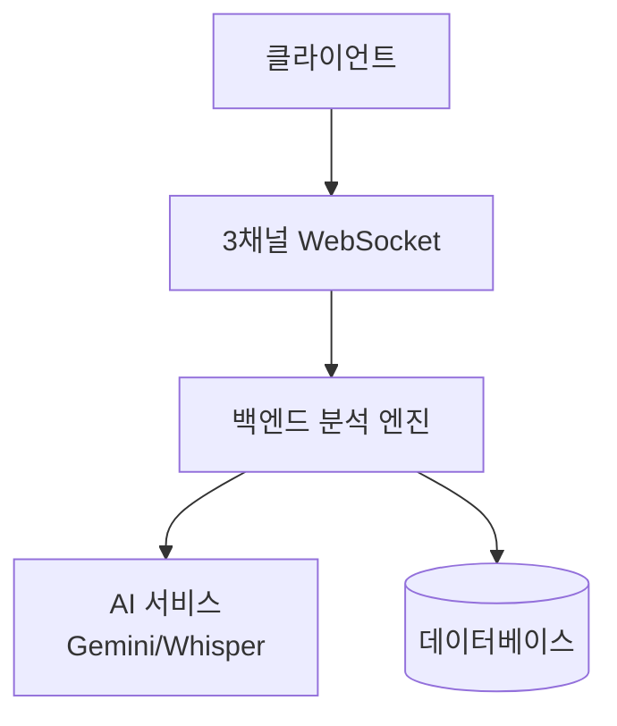

# 📚 BeMore 프로젝트 문서

> 실시간 멀티모달 감정 분석을 통한 AI 기반 심리 상담 지원 시스템

---

## 🎯 문서 개요

이 디렉토리는 BeMore 프로젝트의 전체 기술 문서를 포함합니다. 프로젝트를 이해하고 개발하는 데 필요한 모든 정보가 체계적으로 정리되어 있습니다.

---

## 📖 문서 목록

### **1. [아키텍처 문서](./ARCHITECTURE.md)** 🏗️

**내용:**
- 전체 시스템 아키텍처 다이어그램 (Mermaid)
- 레이어별 상세 구조 (클라이언트/백엔드/데이터)
- 데이터 흐름 시퀀스 다이어그램
- 핵심 컴포넌트 설명 (VAD, CBT, 멀티모달 분석기)
- 기술 스택 및 선택 이유
- 성능 특성 및 병목 지점
- 보안 고려사항
- 확장성 전략 (수평 확장, 마이크로서비스)

**대상:**
- 시스템 설계를 이해하고 싶은 개발자
- 기술적 의사결정이 필요한 아키텍트
- 프로젝트에 새로 합류하는 팀원

**핵심 다이어그램:**


---

### **2. [API 명세서](./API.md)** 📡

**내용:**
- REST API 엔드포인트 (12개)
  - 세션 관리 (시작/일시정지/재개/종료)
  - 데이터 조회 (감정 타임라인, 리포트)
  - CBT 분석 (Phase 3)
  - STT 변환
- WebSocket API (3채널)
  - `/ws/landmarks` - 얼굴 표정 데이터
  - `/ws/voice` - 음성/VAD 데이터
  - `/ws/session` - 세션 제어 & 분석 결과
- 데이터 모델 (TypeScript 인터페이스)
- 에러 코드 및 처리 방법
- Rate Limiting 정책 (Phase 5)
- SDK 사용 예시

**대상:**
- 백엔드 API를 구현하는 개발자
- 프론트엔드와 통신을 연동하는 개발자
- API를 테스트하는 QA 엔지니어

**빠른 시작:**
```javascript
// 세션 시작
POST /api/session/start
{ "userId": "user_123", "counselorId": "counselor_456" }

// WebSocket 연결
ws://localhost:8000/ws/landmarks?sessionId=xxx
ws://localhost:8000/ws/voice?sessionId=xxx
ws://localhost:8000/ws/session?sessionId=xxx
```

---

### **3. [개발 진행 상황 - 2025.10.18](./251018.md)** 📅

**내용:**
- Phase 1-4 핵심 기능 구현 완료 기록
- Phase 1: 기본 세션 관리 & WebSocket 3채널 시스템
- Phase 2: VAD (Voice Activity Detection) 시스템
- Phase 3: CBT (인지행동치료) 시스템
- Phase 4: 통합 분석 & 세션 리포트
- 각 Phase별 구현 내용, 테스트 결과, 커밋 히스토리
- 전체 시스템 아키텍처 및 데이터 흐름
- 성능 지표 및 기술 스택

**대상:**
- 초기 개발 과정을 이해하고 싶은 팀원
- Phase 1-4 구현 세부 사항이 필요한 개발자

---

### **4. [개발 진행 상황 - 2025.10.19](./251019.md)** 📅

**내용:**
- Phase 5: 안정성 및 사용성 개선 작업 기록
- **A. 프론트엔드 UX 개선 (7개)**
  - WebSocket 자동 재연결 시스템
  - 로딩 상태 및 프로그레스 바
  - 실시간 STT 자막 표시
  - 에러 모달 및 피드백
  - 세션 리포트 자동 표시
  - WebSocket 연결 상태 표시
  - VAD 임계값 동적 조정 UI
- **B. 백엔드 안정성 개선 (5개)**
  - 브라우저 호환성 체크
  - 얼굴 감지 실패 처리
  - STT 노이즈 필터링
  - 글로벌 에러 핸들러
  - 에러 로깅 표준화
- **C. 성능 최적화 (3개)**
  - VAD + STT 통합 (비용 50% 절감)
  - VAD 임계값 최적화
  - tmp 디렉토리 자동 생성
- 총 17개 개선 사항 및 테스트 결과

**대상:**
- 최신 개선 사항을 파악하고 싶은 팀원
- Phase 5 UX/안정성 개선 세부 사항이 필요한 개발자

---

### **5. [다음 단계 가이드](./NEXT_STEPS.md)** 🎯

**내용:**
- ✅ 완료된 기능 체크리스트
- 📋 다음 단계 작업 목록
- 🎯 우선순위별 분류 (High/Medium/Low)
- 📅 예상 일정 및 작업 범위
- Phase 6 계획 (MongoDB, 보안, 성능, 배포)

**대상:**
- 다음 작업을 계획하는 PM 및 개발자
- 우선순위를 파악하고 싶은 팀원

---

### **6. 기타 기술 문서**

- **[IMPLEMENTATION_GUIDE.md](./IMPLEMENTATION_GUIDE.md)**: 구현 가이드
- **[LANDMARK_COMPARISON.md](./LANDMARK_COMPARISON.md)**: 랜드마크 압축 비교
- **[IMPROVEMENT_PLAN.md](./IMPROVEMENT_PLAN.md)**: 개선 계획

---

## 🚀 빠른 시작 가이드

### **프로젝트 이해하기**

1. **[ARCHITECTURE.md](./ARCHITECTURE.md)** 먼저 읽기
   - 시스템 전체 구조 파악
   - 주요 컴포넌트 이해
   - 데이터 흐름 확인

2. **[251019.md](./251019.md)** 최신 개발 상황 확인
   - Phase 5 안정성/UX 개선 사항
   - 최신 기능 및 버그 수정
   - 성능 최적화 내용

3. **[API.md](./API.md)** API 명세 숙지
   - 엔드포인트 확인
   - 데이터 모델 이해
   - 통신 프로토콜 학습

4. **[NEXT_STEPS.md](./NEXT_STEPS.md)** 다음 단계 확인
   - 완료된 작업 체크리스트
   - 우선순위별 작업 목록
   - Phase 6 계획

---

## 📂 문서 구조

```
docs/
├── README.md                   # 📚 이 파일 (문서 인덱스)
├── ARCHITECTURE.md             # 🏗️ 시스템 아키텍처
├── API.md                      # 📡 API 명세서
├── 251018.md                   # 📅 Phase 1-4 구현 기록 (2025.10.18)
├── 251019.md                   # 📅 Phase 5 안정성/UX 개선 (2025.10.19)
├── NEXT_STEPS.md               # 🎯 다음 단계 가이드
├── IMPLEMENTATION_GUIDE.md     # 📖 구현 가이드
├── LANDMARK_COMPARISON.md      # 📊 랜드마크 압축 비교
└── IMPROVEMENT_PLAN.md         # 📋 개선 계획
```

---

## 🎯 역할별 추천 문서

### **프론트엔드 개발자**
1. ✅ [API.md](./API.md) - WebSocket 통신 방법
2. ✅ [251019.md](./251019.md) - UX 개선 사항 (Phase 5)
3. ✅ [ARCHITECTURE.md](./ARCHITECTURE.md) - 클라이언트 계층 구조

### **백엔드 개발자**
1. ✅ [ARCHITECTURE.md](./ARCHITECTURE.md) - 백엔드 계층 구조
2. ✅ [API.md](./API.md) - REST/WebSocket 구현 명세
3. ✅ [251019.md](./251019.md) - 안정성 개선 사항 (Phase 5)
4. ✅ [NEXT_STEPS.md](./NEXT_STEPS.md) - 다음 작업 계획

### **데이터 사이언티스트**
1. ✅ [ARCHITECTURE.md](./ARCHITECTURE.md) - AI 엔진 구조 (VAD, CBT)
2. ✅ [251018.md](./251018.md) - Phase 2-3 AI 통합 완료 내역
3. ✅ [API.md](./API.md) - 데이터 모델 및 입출력 포맷

### **프로젝트 매니저**
1. ✅ [NEXT_STEPS.md](./NEXT_STEPS.md) - 완료 현황 및 다음 단계
2. ✅ [251019.md](./251019.md) - 최신 개발 진행 상황
3. ✅ [ARCHITECTURE.md](./ARCHITECTURE.md) - 기술 스택 및 리스크

### **신규 팀원**
1. ✅ [ARCHITECTURE.md](./ARCHITECTURE.md) - 시스템 전체 이해
2. ✅ [251018.md](./251018.md) - Phase 1-4 개발 과정
3. ✅ [251019.md](./251019.md) - Phase 5 개선 사항
4. ✅ [API.md](./API.md) - API 사용법

---

## 🔄 문서 업데이트 정책

### **문서 버전 관리**

각 문서는 다음 형식으로 버전을 관리합니다:

```markdown
**마지막 업데이트:** 2025-01-17
**문서 버전:** 1.0.0
**프로젝트 버전:** v0.1.0 (MVP)
```

### **업데이트 주기**

| 문서 | 업데이트 주기 | 담당자 |
|------|--------------|--------|
| ARCHITECTURE.md | 아키텍처 변경 시 | 백엔드 리드 |
| API.md | API 변경 시 | 백엔드 개발자 |
| 251xxx.md | 매 Phase 완료 시 | 백엔드 개발자 |
| NEXT_STEPS.md | Phase 종료 시 | PM |
| README.md | 필요 시 | 전체 팀 |

### **변경 이력**

각 문서 하단에 변경 이력을 기록합니다:

```markdown
## 📝 변경 이력

### v1.1.0 (2025-01-24)
- Phase 1 구현 완료 반영
- WebSocket 재연결 로직 추가

### v1.0.0 (2025-01-17)
- 초기 문서 작성
```

---

## 🤝 기여 가이드

### **문서 기여 방법**

1. **오타 수정 또는 간단한 개선**
   - 직접 수정 후 커밋
   - 커밋 메시지: `docs: Fix typo in ARCHITECTURE.md`

2. **구조적 변경 또는 새 섹션 추가**
   - Issue 생성 후 논의
   - PR 제출 및 리뷰 요청

### **문서 작성 규칙**

- ✅ **Markdown 문법** 준수
- ✅ **Mermaid 다이어그램** 활용 (시각화)
- ✅ **코드 예시** 포함 (JavaScript/TypeScript)
- ✅ **이모지** 적절히 사용 (가독성)
- ✅ **목차** 필수 (긴 문서)
- ✅ **링크** 내부 문서 간 연결

---

## 📊 문서 통계

| 문서 | 줄 수 | 다이어그램 수 | 상태 |
|------|-------|--------------|------|
| ARCHITECTURE.md | ~800 | 8개 | ✅ 최신 |
| API.md | ~1,200 | 0개 | ✅ 최신 |
| 251018.md | ~950 | 1개 | ✅ Phase 1-4 |
| 251019.md | ~700 | 1개 | ✅ Phase 5 |
| NEXT_STEPS.md | ~110 | 0개 | ✅ 최신 |
| IMPLEMENTATION_GUIDE.md | ~600 | 2개 | ✅ 최신 |
| LANDMARK_COMPARISON.md | ~200 | 1개 | ✅ 최신 |
| IMPROVEMENT_PLAN.md | ~100 | 0개 | ✅ 최신 |
| **합계** | **~4,660** | **13개** | - |

---

## 🔗 외부 참고 자료

### **기술 문서**
- [MediaPipe Face Mesh](https://google.github.io/mediapipe/solutions/face_mesh)
- [OpenAI Whisper](https://platform.openai.com/docs/guides/speech-to-text)
- [Google Gemini](https://ai.google.dev/gemini-api/docs)
- [Silero VAD](https://github.com/snakers4/silero-vad)

### **인지행동치료 (CBT)**
- [인지 왜곡 10가지](https://www.mindful.org/cognitive-distortions/)
- [CBT 개입 기법](https://positivepsychology.com/cbt-techniques/)

### **WebSocket**
- [ws 라이브러리](https://github.com/websockets/ws)
- [WebSocket MDN](https://developer.mozilla.org/en-US/docs/Web/API/WebSockets_API)

---

## ❓ 자주 묻는 질문 (FAQ)

### **Q1: 문서를 어떤 순서로 읽어야 하나요?**
**A:** ARCHITECTURE.md → ROADMAP.md → API.md 순서를 추천합니다.

### **Q2: API 명세가 변경되면 어떻게 알 수 있나요?**
**A:** API.md 하단의 "변경 이력" 섹션을 확인하거나, Git 커밋 히스토리를 확인하세요.

### **Q3: 새로운 문서를 추가하고 싶어요.**
**A:** Issue를 생성하여 문서 제안 → 팀 리뷰 → docs/ 폴더에 추가 → 이 README에 링크 추가

### **Q4: Mermaid 다이어그램이 보이지 않아요.**
**A:** GitHub에서는 자동 렌더링됩니다. 로컬에서는 VSCode + Mermaid 확장을 설치하세요.

---

## 📞 문의 및 피드백

- **문서 오류 제보:** GitHub Issues
- **개선 제안:** Pull Request
- **질문:** 팀 채널 또는 담당자에게 직접 문의

---

**마지막 업데이트:** 2025-10-19
**문서 버전:** 1.1.0
**프로젝트 상태:** Phase 5 완료 (안정성/UX 개선)
**관리자:** BeMore 개발팀
