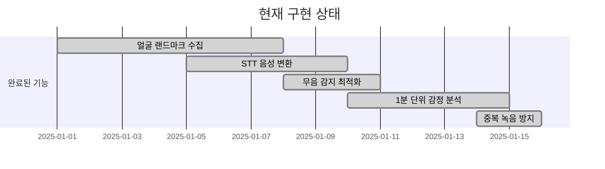
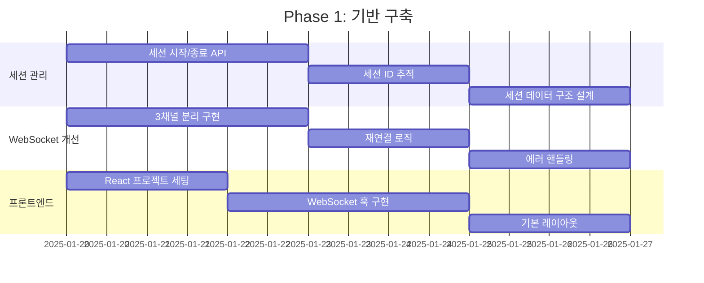
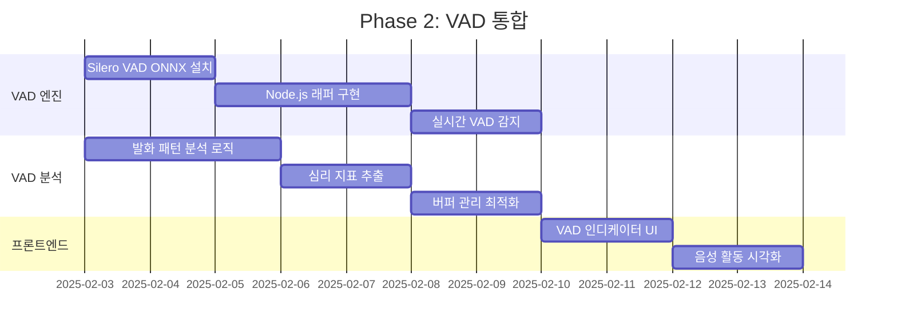
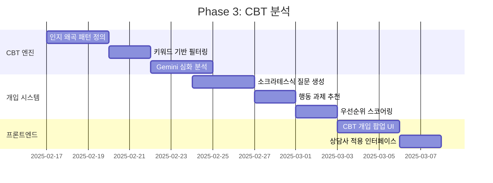
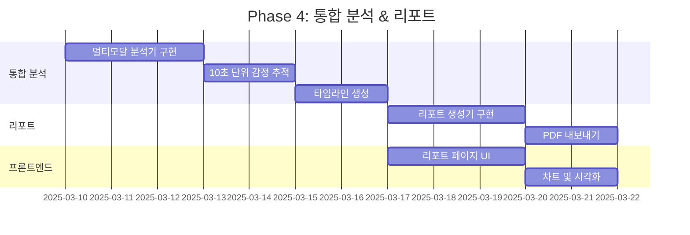
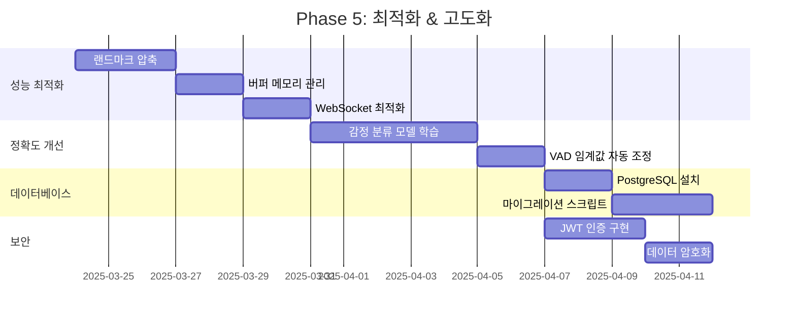
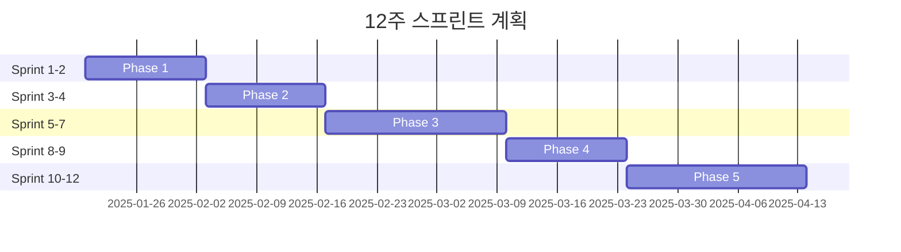

# 🗺️ BeMore 개발 로드맵

> 실시간 멀티모달 감정 분석 시스템 구현 계획

---

## 📋 목차

- [프로젝트 개요](#프로젝트-개요)
- [현재 상태](#현재-상태)
- [개발 단계](#개발-단계)
- [마일스톤](#마일스톤)
- [기술 부채 및 리스크](#기술-부채-및-리스크)

---

## 🎯 프로젝트 개요

### **목표**
실시간 얼굴 표정, 음성, 대화 내용을 종합 분석하여 **사용자의 심리 상태를 예측하고 인지행동치료(CBT) 개입을 추천**하는 AI 상담 지원 시스템

### **핵심 가치**
- ✅ **실시간성**: 10초 단위 감정 피드백
- ✅ **멀티모달**: 표정 + 음성 + 텍스트 통합 분석
- ✅ **치료 지원**: CBT 기반 인지 왜곡 자동 탐지
- ✅ **확장성**: 마이크로서비스 전환 가능한 아키텍처

---

## 📊 현재 상태

### **✅ 구현 완료** (v0.1.0 - MVP)



**기능:**
1. ✅ MediaPipe로 실시간 얼굴 랜드마크 추출 (468 points)
2. ✅ WebSocket으로 1분간 표정 데이터 누적 전송
3. ✅ OpenAI Whisper로 5초 단위 STT 변환
4. ✅ ffmpeg 무음 감지로 API 호출 최적화
5. ✅ Gemini 2.5 Flash로 표정+STT 통합 분석
6. ✅ 1분 주기 감정 분석 결과 반환

**기술 스택:**
- Backend: Node.js + Express + WebSocket
- Frontend: HTML5 + MediaPipe (CDN)
- AI: Google Gemini 2.5 Flash, OpenAI Whisper

### **⚠️ 미구현 / 제한사항**

| 항목 | 상태 | 우선순위 |
|------|------|----------|
| 세션 관리 (시작/종료) | ❌ 없음 | 🔴 높음 |
| 프론트엔드 통합 | ❌ 테스트 페이지만 | 🔴 높음 |
| VAD 음성 활동 감지 | ❌ 없음 | 🟡 중간 |
| CBT 인지 왜곡 탐지 | ❌ 없음 | 🟡 중간 |
| 실시간 개입 제안 | ❌ 없음 | 🟡 중간 |
| 리포트 생성 | ❌ 없음 | 🟢 보통 |
| 데이터베이스 | ❌ 없음 | 🟢 보통 |
| 인증/권한 | ❌ 없음 | 🔵 낮음 |

---

## 🚀 개발 단계

### **Phase 1: 기반 구축** (2주, Week 1-2)



#### **목표**
- 현재 시스템 안정화
- 세션 생명주기 관리
- 프론트엔드 기본 구조

#### **주요 작업**

**1.1 세션 관리 시스템**
```javascript
// services/session/SessionManager.js
class SessionManager {
  createSession(userId, counselorId)
  pauseSession(sessionId)
  resumeSession(sessionId)
  endSession(sessionId)
  getSession(sessionId)
}
```

**작업:**
- [ ] SessionManager 클래스 구현
- [ ] 세션 ID 생성 로직 (UUID)
- [ ] 세션 상태 관리 (active/paused/ended)
- [ ] 메모리 기반 세션 저장소
- [ ] API 엔드포인트 추가
  - `POST /api/session/start`
  - `POST /api/session/:id/pause`
  - `POST /api/session/:id/resume`
  - `POST /api/session/:id/end`
  - `GET /api/session/:id`

**1.2 WebSocket 3채널 분리**
```javascript
// services/socket/setupWebSockets.js
setupWebSockets(server) {
  // /ws/landmarks - 얼굴 표정
  // /ws/voice     - 음성/VAD
  // /ws/session   - 세션 제어
}
```

**작업:**
- [ ] URL 기반 라우팅 구현
- [ ] sessionId 쿼리 파라미터 검증
- [ ] 채널별 핸들러 분리
- [ ] 재연결 로직 구현
- [ ] 에러 핸들링 강화

**1.3 프론트엔드 기본 구조**
```bash
frontend/
├── pages/
│   ├── index.jsx          # 홈 (상담 시작)
│   ├── session/[id].jsx   # 상담 진행
│   └── report/[id].jsx    # 리포트 조회
├── components/
│   ├── VideoView.jsx
│   ├── EmotionGraph.jsx
│   └── SessionControls.jsx
└── hooks/
    ├── useWebSocket.js
    ├── useMediaPipe.js
    └── useSession.js
```

**작업:**
- [ ] Next.js 프로젝트 초기화
- [ ] Tailwind CSS 설정
- [ ] useWebSocket 훅 구현
- [ ] useSession 훅 구현
- [ ] 세션 페이지 기본 레이아웃

**완료 조건:**
- ✅ 세션 시작/종료가 정상 작동
- ✅ 3개 WebSocket 채널 독립 운영
- ✅ 프론트엔드에서 세션 제어 가능
- ✅ 재연결 시 데이터 유실 없음

---

### **Phase 2: VAD 통합** (2주, Week 3-4)



#### **목표**
- 음성 활동 실시간 감지
- 발화 패턴 분석 (속도/길이/빈도)
- 심리 지표 추출 (우울/불안)

#### **주요 작업**

**2.1 Silero VAD 연동**
```bash
# 설치
npm install onnxruntime-node

# 모델 다운로드
mkdir -p models
wget https://github.com/snakers4/silero-vad/raw/master/files/silero_vad.onnx \
  -O models/silero_vad.onnx
```

**작업:**
- [ ] ONNX Runtime 설치 및 테스트
- [ ] Silero VAD 모델 통합
- [ ] 오디오 전처리 파이프라인
- [ ] 실시간 음성/무음 감지

**2.2 VAD 분석 로직**
```javascript
// services/vad/vadAnalyzer.js
class VADAnalyzer {
  detectVoiceActivity(audioBuffer)
  analyzeVoicePattern(sessionData)
  calculatePsychologicalIndicators()
}
```

**작업:**
- [ ] 음성/무음 세그먼트 분류
- [ ] 발화 속도 계산 (평균 발화 길이)
- [ ] 침묵 패턴 분석 (평균 침묵 길이)
- [ ] 발화 빈도 계산 (분당 발화 횟수)
- [ ] 심리 지표 추출
  - 우울 지표: 침묵 비율 70% 이상
  - 불안 지표: 발화 빈도 15회/분 이상

**2.3 프론트엔드 VAD UI**
```jsx
// components/VADIndicator.jsx
<div className="vad-indicator">
  {isVoiceActive ? (
    <span className="text-green-500 animate-pulse">🎤 말하는 중</span>
  ) : (
    <span className="text-gray-500">🔇 침묵</span>
  )}
</div>
```

**작업:**
- [ ] useVAD 훅 구현
- [ ] 실시간 음성 활동 표시
- [ ] VAD 메트릭 시각화
- [ ] 발화/침묵 타임라인 차트

**완료 조건:**
- ✅ VAD가 음성/무음을 정확히 구분 (>90% 정확도)
- ✅ 발화 패턴 분석 데이터 출력
- ✅ 프론트엔드에서 실시간 VAD 상태 확인
- ✅ 심리 지표가 의미 있는 값 반환

---

### **Phase 3: CBT 분석** (2-3주, Week 5-7)



#### **목표**
- 인지 왜곡 자동 탐지 (10가지 유형)
- 치료적 개입 자동 추천
- 상담사 워크플로우 지원

#### **주요 작업**

**3.1 CBT Analyzer 구현**
```javascript
// services/cbt/cbtAnalyzer.js
class CBTAnalyzer {
  // 10가지 인지 왜곡 패턴
  distortionPatterns = {
    catastrophizing: [...],
    allOrNothing: [...],
    overgeneralization: [...],
    // ...
  }

  detectDistortions(texts)
  analyzeConversation(speechTexts, emotionData)
  generateCBTIntervention(distortionType)
}
```

**작업:**
- [ ] 10가지 인지 왜곡 키워드 정의
- [ ] 1차 키워드 매칭 필터
- [ ] Gemini 프롬프트 최적화
- [ ] 심각도 평가 (1-10)
- [ ] 구체적 사례 추출
- [ ] 소크라테스식 질문 생성
- [ ] 행동 과제 제안

**3.2 개입 추천 시스템**
```javascript
// 실시간 개입 트리거
if (distortion.severity >= 7) {
  ws.send({
    type: 'cbt_intervention',
    intervention: {
      distortionType: 'catastrophizing',
      severity: 8,
      questions: [...]
    }
  });
}
```

**작업:**
- [ ] 실시간 개입 트리거 로직
- [ ] 개입 우선순위 알고리즘
- [ ] 중복 개입 방지 (디바운싱)
- [ ] 개입 효과 추적

**3.3 프론트엔드 CBT UI**
```jsx
// components/CBTIntervention.jsx
<div className="cbt-panel">
  <h3>💡 CBT 개입 제안</h3>
  {interventions.map(i => (
    <InterventionCard
      key={i.id}
      distortion={i.distortionType}
      severity={i.severity}
      questions={i.questions}
      onApply={() => applyIntervention(i.id)}
    />
  ))}
</div>
```

**작업:**
- [ ] 개입 제안 팝업 컴포넌트
- [ ] 상담사 적용 버튼
- [ ] 적용 이력 표시
- [ ] 진행도 추적 대시보드

**완료 조건:**
- ✅ 인지 왜곡을 정확히 탐지 (>80% 정확도)
- ✅ 의미 있는 소크라테스식 질문 생성
- ✅ 상담사가 쉽게 적용 가능
- ✅ 실시간 개입 제안이 자연스럽게 표시

---

### **Phase 4: 통합 분석 & 리포트** (2주, Week 8-9)



#### **목표**
- 표정+음성+텍스트 통합 분석
- 세션별 종합 리포트 생성
- 데이터 시각화

#### **주요 작업**

**4.1 Multimodal Analyzer**
```javascript
// services/analysis/multimodalAnalyzer.js
class MultimodalAnalyzer {
  analyzeSession(sessionId) {
    const landmarks = getLandmarks(sessionId);
    const vadMetrics = getVADMetrics(sessionId);
    const sttTexts = getSTTTexts(sessionId);

    const emotion = this.fuseFeatures(landmarks, vadMetrics, sttTexts);
    return emotion;
  }
}
```

**작업:**
- [ ] 특징 추출 (표정/음성/텍스트)
- [ ] 특징 융합 알고리즘
- [ ] 10초 단위 감정 추적
- [ ] 시간적 일관성 체크
- [ ] 신뢰도 계산

**4.2 Report Generator**
```javascript
// services/report/reportGenerator.js
class ReportGenerator {
  generateSessionReport(sessionId) {
    return {
      summary: {...},
      emotionTimeline: [...],
      vadMetrics: {...},
      cbtAnalysis: {...},
      recommendations: [...]
    };
  }

  exportToPDF(report)
}
```

**작업:**
- [ ] 세션 요약 생성
- [ ] 감정 분포 차트
- [ ] VAD 메트릭 요약
- [ ] CBT 분석 리포트
- [ ] 치료 권장사항
- [ ] PDF 내보내기 (puppeteer)

**4.3 프론트엔드 리포트 페이지**
```jsx
// pages/report/[id].jsx
<div className="report-page">
  <EmotionTimeline data={timeline} />
  <VADMetrics metrics={vadMetrics} />
  <CBTSummary analysis={cbtAnalysis} />
  <Recommendations items={recommendations} />
  <ExportButton />
</div>
```

**작업:**
- [ ] 리포트 페이지 레이아웃
- [ ] 감정 타임라인 그래프 (Chart.js)
- [ ] VAD 메트릭 카드
- [ ] CBT 분석 요약
- [ ] PDF 다운로드 버튼

**완료 조건:**
- ✅ 멀티모달 통합 분석이 정상 작동
- ✅ 리포트가 모든 데이터 포함
- ✅ 시각화가 직관적이고 명확
- ✅ PDF 내보내기 가능

---

### **Phase 5: 최적화 & 고도화** (2-3주, Week 10-12)



#### **목표**
- 성능 최적화 (응답 시간, 메모리)
- 정확도 개선
- 데이터베이스 통합
- 보안 강화

#### **주요 작업**

**5.1 성능 최적화**
```javascript
// 랜드마크 압축: 468개 → 9개
const KEY_LANDMARKS = [33, 133, 362, 263, 1, 61, 291, 152, 168];
const compressed = landmarks.filter((_, i) => KEY_LANDMARKS.includes(i));

// 데이터 감소: 60% ↓
```

**작업:**
- [ ] 랜드마크 데이터 압축 (468 → 9)
- [ ] WebSocket 메시지 배칭
- [ ] 버퍼 메모리 관리 (순환 버퍼)
- [ ] Gemini API 캐싱
- [ ] 이미지 최적화

**5.2 정확도 개선**
```javascript
// TensorFlow.js 감정 분류 모델
const model = await tf.loadLayersModel('./models/emotion_model.json');
const emotion = model.predict(features);

// Gemini 대체 → 비용 절감 + 속도 향상
```

**작업:**
- [ ] 감정 분류 데이터셋 수집
- [ ] TensorFlow.js 모델 학습
- [ ] 모델 평가 (정확도, F1 스코어)
- [ ] Gemini와 앙상블
- [ ] VAD 임계값 자동 조정

**5.3 데이터베이스 통합**
```sql
-- schema.sql
CREATE TABLE sessions (
  id UUID PRIMARY KEY,
  user_id UUID,
  counselor_id UUID,
  started_at TIMESTAMP,
  ended_at TIMESTAMP,
  status VARCHAR(20)
);

CREATE TABLE emotions (
  id SERIAL PRIMARY KEY,
  session_id UUID,
  timestamp TIMESTAMP,
  emotion VARCHAR(50),
  score INTEGER
);

CREATE TABLE cbt_distortions (
  id SERIAL PRIMARY KEY,
  session_id UUID,
  distortion_type VARCHAR(50),
  severity INTEGER,
  example TEXT
);
```

**작업:**
- [ ] PostgreSQL 설치 및 설정
- [ ] 스키마 설계
- [ ] Prisma ORM 통합
- [ ] 마이그레이션 스크립트
- [ ] 세션 데이터 영속화

**5.4 보안 강화**
```javascript
// JWT 인증
const token = jwt.sign({ userId, role }, process.env.JWT_SECRET);

// WebSocket 인증
ws.on('connection', (socket, req) => {
  const token = req.headers.authorization;
  const user = verifyToken(token);
  if (!user) socket.close();
});
```

**작업:**
- [ ] JWT 기반 인증
- [ ] WebSocket 인증
- [ ] 세션 데이터 암호화
- [ ] CORS 설정
- [ ] Rate Limiting

**완료 조건:**
- ✅ 응답 시간 <2초 (95th percentile)
- ✅ 메모리 사용량 <500MB
- ✅ 감정 분류 정확도 >85%
- ✅ 데이터베이스 정상 작동
- ✅ 보안 취약점 없음

---

## 🎯 마일스톤

### **M1: MVP 완성** (Week 1-4)
```
목표: 기본 기능이 모두 작동하는 프로토타입
- ✅ 세션 시작/종료
- ✅ 3채널 WebSocket 통신
- ✅ VAD 음성 활동 감지
- ✅ 기본 프론트엔드 UI
- ✅ 10초 단위 감정 분석

검증: 30분 모의 상담 시연 성공
```

### **M2: CBT 기능 통합** (Week 5-7)
```
목표: 치료적 가치를 제공하는 시스템
- ✅ 인지 왜곡 자동 탐지
- ✅ 실시간 개입 제안
- ✅ 상담사 워크플로우
- ✅ CBT 분석 리포트

검증: 실제 상담사 피드백 수집
```

### **M3: 프로덕션 준비** (Week 8-12)
```
목표: 안정적이고 확장 가능한 시스템
- ✅ 멀티모달 통합 분석
- ✅ 세션 리포트 생성
- ✅ 성능 최적화
- ✅ 데이터베이스 통합
- ✅ 보안 강화

검증: 부하 테스트 (동시 10명 상담)
```

---

## ⚠️ 기술 부채 및 리스크

### **현재 기술 부채**

| 항목 | 심각도 | 해결 시기 | 비고 |
|------|--------|----------|------|
| 1분 주기 분석 (너무 느림) | 🔴 높음 | Phase 1 | 10초로 단축 필요 |
| 468개 랜드마크 전송 | 🟡 중간 | Phase 5 | 압축 필요 (60% 감소) |
| Gemini API 의존 | 🟡 중간 | Phase 5 | 자체 모델 학습 |
| 메모리 기반 세션 관리 | 🟡 중간 | Phase 5 | DB로 마이그레이션 |
| 인증 없음 | 🟢 보통 | Phase 5 | JWT 구현 |

### **리스크 관리**

#### **🔴 높은 리스크**

**1. Gemini API 비용 증가**
- **위험**: 사용자 증가 시 비용 폭증
- **대응**: Phase 5에서 자체 모델 학습
- **계획 B**: GPT-4o-mini로 전환 (더 저렴)

**2. 실시간 성능 저하**
- **위험**: 동시 접속자 증가 시 지연 발생
- **대응**: Phase 5 성능 최적화
- **계획 B**: 마이크로서비스 분리, 메시지 큐 도입

#### **🟡 중간 리스크**

**3. VAD 정확도 낮음**
- **위험**: 음성/무음 오판으로 잘못된 분석
- **대응**: Silero VAD 임계값 튜닝
- **계획 B**: WebRTC VAD + Silero VAD 앙상블

**4. CBT 분석 정확도**
- **위험**: 인지 왜곡 오탐/미탐
- **대응**: 키워드 확장 + Gemini 프롬프트 개선
- **계획 B**: 전문 상담사 피드백으로 지속 학습

#### **🟢 낮은 리스크**

**5. 브라우저 호환성**
- **위험**: Safari에서 MediaPipe 작동 불안정
- **대응**: Polyfill 추가, 브라우저별 테스트
- **계획 B**: 네이티브 앱 전환

---

## 📈 성공 지표 (KPI)

### **기술 지표**

| 지표 | 목표 | 현재 | 달성 시기 |
|------|------|------|----------|
| 응답 시간 (95th) | <2초 | ~5초 | Phase 1 |
| 감정 분류 정확도 | >85% | ~70% | Phase 5 |
| VAD 정확도 | >90% | - | Phase 2 |
| CBT 탐지 정확도 | >80% | - | Phase 3 |
| 동시 세션 처리 | 10명 | 1명 | Phase 5 |
| WebSocket 가용성 | 99% | ~95% | Phase 1 |

### **비즈니스 지표**

| 지표 | 목표 | 측정 방법 |
|------|------|----------|
| 상담사 만족도 | >4.0/5.0 | 설문 조사 |
| 개입 적용률 | >60% | 로그 분석 |
| 리포트 활용도 | >80% | 다운로드 수 |
| 시스템 가동률 | >99% | 모니터링 |

---

## 🔄 이터레이션 계획

### **스프린트 구조** (2주 단위)



### **주간 체크포인트**

**매주 금요일:**
- [ ] 이번 주 완료 작업 검토
- [ ] 기술 부채 평가
- [ ] 다음 주 목표 설정
- [ ] 리스크 재평가

---

## 📚 참고 문서

- [아키텍처 문서](./ARCHITECTURE.md)
- [API 명세서](./API.md)
- [데이터 모델](./DATA_MODEL.md)
- [배포 가이드](./DEPLOYMENT.md)

---

**마지막 업데이트:** 2025-01-17
**문서 버전:** 1.0.0
**프로젝트 버전:** v0.1.0 (MVP)
