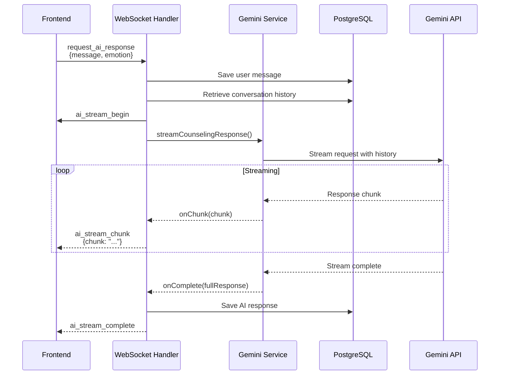

# 🤖 BeMore AI 음성 상담 구현 가이드 (Node.js)

**작성일**: 2025-01-14
**버전**: 1.0.0
**기술 스택**: Node.js + Express.js + WebSocket + Google Gemini API
**상태**: ✅ 완전 구현됨

---

## 📋 목차

1. [개요](#개요)
2. [시스템 아키텍처](#시스템-아키텍처)
3. [WebSocket API 스펙](#websocket-api-스펙)
4. [구현 세부사항](#구현-세부사항)
5. [프론트엔드 통합](#프론트엔드-통합)
6. [테스트 방법](#테스트-방법)
7. [트러블슈팅](#트러블슈팅)

---

## 개요

BeMore의 AI 음성 상담 기능은 사용자의 음성 입력(STT 변환 후)과 현재 감정 상태를 기반으로
Google Gemini API를 사용하여 실시간 스트리밍 상담 응답을 제공합니다.

### 주요 기능

- ✅ **실시간 스트리밍**: AI 응답을 청크 단위로 실시간 전송
- ✅ **감정 기반 프롬프트**: 8개 감정에 맞춘 상담 톤 자동 조정
- ✅ **대화 히스토리 관리**: 최근 10개 대화 기억 (맥락 유지)
- ✅ **데이터베이스 영구 저장**: PostgreSQL conversations 테이블
- ✅ **타임아웃 보호**: 45초 제한으로 무한 대기 방지
- ✅ **에러 핸들링**: 세션 검증, 메시지 검증, API 에러 처리

### 기술 스택

| 컴포넌트 | 기술 | 버전 |
|---------|------|------|
| **AI 모델** | Google Gemini 2.5 Flash | Latest |
| **SDK** | @google/generative-ai | ^0.24.1 |
| **WebSocket** | ws | ^8.18.3 |
| **ORM** | Sequelize | ^6.37.7 |
| **Database** | PostgreSQL (Supabase) | 15+ |

---

## 시스템 아키텍처

### 데이터 흐름



### 주요 컴포넌트

#### 1. WebSocket Handler
**파일**: [`services/socket/sessionHandler.js:277-377`](../../services/socket/sessionHandler.js#L277-L377)

**역할**:
- 클라이언트 메시지 수신 및 검증
- 스트리밍 이벤트 전송 (`ai_stream_begin`, `ai_stream_chunk`, `ai_stream_complete`)
- 에러 핸들링 및 로깅

#### 2. Gemini Service
**파일**: [`services/gemini/gemini.js:498-566`](../../services/gemini/gemini.js#L498-L566)

**역할**:
- Gemini API 스트리밍 호출
- 감정 기반 시스템 프롬프트 생성
- 타임아웃 보호 (45초)
- 대화 히스토리 포맷팅

#### 3. Conversation Model
**파일**: [`models/Conversation.js`](../../models/Conversation.js)

**역할**:
- 대화 데이터 CRUD 작업
- 세션별 최근 대화 조회 (최대 10개)
- 타임스탬프 자동 관리

#### 4. Prompt Builder
**파일**: [`services/gemini/prompts.js`](../../services/gemini/prompts.js)

**역할**:
- 8개 감정별 시스템 프롬프트 제공
- 대화 히스토리 Gemini 형식 변환

---

## WebSocket API 스펙

### Endpoint

```
ws://<backend-url>/ws/session/<session_id>
```

**인증**: JWT 토큰 (쿼리 파라미터 또는 헤더)

---

### 메시지 타입: `request_ai_response`

#### Request (Frontend → Backend)

```json
{
  "type": "request_ai_response",
  "data": {
    "message": "요즘 회사에서 스트레스를 많이 받아요",
    "emotion": "anxious"
  }
}
```

**필드 설명**:

| 필드 | 타입 | 필수 | 설명 |
|-----|------|------|------|
| `type` | string | ✅ | 고정값: `"request_ai_response"` |
| `data.message` | string | ✅ | 사용자 메시지 (1~2000자) |
| `data.emotion` | string\|null | ⚪ | 현재 감정 (8가지 중 하나 또는 null) |

**지원 감정**:
- `happy` - 행복
- `sad` - 슬픔
- `angry` - 분노
- `anxious` - 불안
- `neutral` - 중립
- `surprised` - 놀람
- `disgusted` - 혐오
- `fearful` - 두려움

---

#### Response (Backend → Frontend)

**3단계 스트리밍**:

##### 1️⃣ 스트리밍 시작

```json
{
  "type": "ai_stream_begin",
  "data": {}
}
```

**수신 시점**: Gemini API 호출 직후
**프론트엔드 처리**: 로딩 UI 표시, 버퍼 초기화

---

##### 2️⃣ 응답 청크 (여러 번)

```json
{
  "type": "ai_stream_chunk",
  "data": {
    "chunk": "스트레스를 받고 계시는군요. "
  }
}
```

**수신 빈도**: 평균 50-100ms 간격
**프론트엔드 처리**:
- 텍스트 누적 표시
- TTS 엔진에 청크 전달 (실시간 음성 재생)

⚠️ **중요**: 필드명은 반드시 `chunk`여야 합니다 (`text` 아님!)

---

##### 3️⃣ 스트리밍 완료

```json
{
  "type": "ai_stream_complete",
  "data": {}
}
```

**수신 시점**: 모든 청크 전송 완료 + DB 저장 완료
**프론트엔드 처리**:
- 로딩 UI 종료
- 최종 메시지 확정
- TTS 종료 대기

---

##### ❌ 에러 발생 시

```json
{
  "type": "ai_stream_error",
  "data": {
    "error": "AI 서비스가 일시적으로 사용할 수 없습니다"
  }
}
```

**에러 종류**:
- 빈 메시지: `"메시지가 비어있습니다"`
- 길이 초과: `"메시지가 너무 깁니다 (최대 2000자)"`
- API 타임아웃: `"AI 응답 시간 초과 (45초)"`
- API 에러: `"AI 응답 생성 중 오류가 발생했습니다: <상세 에러>"`
- 세션 없음: `"유효하지 않은 세션입니다"`

---

## 구현 세부사항

### 1. Gemini API 스트리밍 (`streamCounselingResponse`)

**위치**: [`services/gemini/gemini.js:498-566`](../../services/gemini/gemini.js#L498-L566)

```javascript
/**
 * Gemini API를 통한 실시간 스트리밍 상담 응답 생성
 *
 * @param {Array} conversationHistory - 대화 히스토리 [{role, content}, ...]
 * @param {string|null} currentEmotion - 현재 감정 (8가지 중 하나)
 * @param {Function} onChunk - 청크 수신 콜백 (chunk: string) => void
 * @param {Function} onComplete - 완료 콜백 (fullResponse: string) => void
 * @param {Function} onError - 에러 콜백 (error: Error) => void
 */
async function streamCounselingResponse(
  conversationHistory,
  currentEmotion,
  onChunk,
  onComplete,
  onError
)
```

**주요 로직**:

1. **시스템 프롬프트 생성**:
   ```javascript
   const systemPrompt = buildSystemPrompt(currentEmotion);
   ```
   - 감정에 따른 맞춤형 상담 가이드라인
   - 예: `anxious` → "안정감을 주는 톤으로 대화하세요"

2. **Gemini 모델 초기화**:
   ```javascript
   const model = genai.getGenerativeModel({
     model: 'gemini-2.5-flash',
     systemInstruction: systemPrompt
   });
   ```

3. **대화 세션 시작**:
   ```javascript
   const chat = model.startChat({
     history: geminiHistory, // 최근 10개 대화
     generationConfig: {
       temperature: 0.7,
       topP: 0.8,
       topK: 40,
       maxOutputTokens: 1024
     }
   });
   ```

4. **스트리밍 요청**:
   ```javascript
   const result = await chat.sendMessageStream(currentMessage);

   for await (const chunk of result.stream) {
     const chunkText = chunk.text();
     fullResponse += chunkText;
     onChunk(chunkText); // 콜백 호출
   }
   ```

5. **타임아웃 보호**:
   ```javascript
   await withTimeout(
     streamingProcess(),
     GEMINI_TIMEOUT_MS // 45000 (45초)
   );
   ```

---

### 2. WebSocket 핸들러 (`handleAIResponseRequest`)

**위치**: [`services/socket/sessionHandler.js:277-377`](../../services/socket/sessionHandler.js#L277-L377)

```javascript
/**
 * AI 응답 요청 처리
 *
 * @param {WebSocket} ws - WebSocket 연결
 * @param {Object} session - SessionManager의 세션 객체
 * @param {Object} data - 클라이언트 요청 데이터 {message, emotion}
 */
async function handleAIResponseRequest(ws, session, data)
```

**처리 흐름**:

```javascript
// 1. 입력 검증
const { message, emotion } = data;
if (!message || message.trim().length === 0) {
  ws.send(JSON.stringify({
    type: 'ai_stream_error',
    data: { error: '메시지가 비어있습니다' }
  }));
  return;
}

if (message.length > 2000) {
  ws.send(JSON.stringify({
    type: 'ai_stream_error',
    data: { error: '메시지가 너무 깁니다 (최대 2000자)' }
  }));
  return;
}

// 2. 사용자 메시지 저장
await Conversation.saveMessage(
  session.sessionId,
  'user',
  message,
  emotion
);

// 3. 대화 히스토리 조회
const history = await Conversation.getHistory(session.sessionId, 10);

// 4. 스트리밍 시작 알림
ws.send(JSON.stringify({
  type: 'ai_stream_begin',
  data: {}
}));

// 5. AI 스트리밍 실행
let fullResponse = '';

await streamCounselingResponse(
  history,
  emotion,

  // onChunk 콜백
  (chunk) => {
    fullResponse += chunk;
    ws.send(JSON.stringify({
      type: 'ai_stream_chunk',
      data: { chunk }
    }));
  },

  // onComplete 콜백
  async () => {
    // AI 응답 저장
    await Conversation.saveMessage(
      session.sessionId,
      'assistant',
      fullResponse,
      null
    );

    // 완료 알림
    ws.send(JSON.stringify({
      type: 'ai_stream_complete',
      data: {}
    }));
  },

  // onError 콜백
  (error) => {
    console.error('[AI Stream Error]', error);
    ws.send(JSON.stringify({
      type: 'ai_stream_error',
      data: { error: error.message }
    }));
  }
);
```

---

### 3. 감정별 시스템 프롬프트

**위치**: [`services/gemini/prompts.js`](../../services/gemini/prompts.js)

**기본 프롬프트**:
```
당신은 전문 심리 상담사입니다.
공감적이고 따뜻한 태도로 내담자의 이야기를 경청하고,
인지행동치료(CBT) 기법을 활용하여 도움을 제공하세요.

응답 가이드라인:
- 한 번에 2-3문장으로 간결하게 응답하세요
- 내담자의 감정을 먼저 인정하고 수용하세요
- 구체적이고 실천 가능한 질문이나 제안을 하세요
- 전문적이면서도 따뜻한 톤을 유지하세요
- 판단하지 말고 경청하세요
```

**감정별 추가 가이드**:

| 감정 | 가이드라인 |
|------|-----------|
| `anxious` | "내담자가 불안해하고 있습니다. 안정감을 주는 톤으로 대화하세요. 걱정을 경청하고 구체적인 대처 방법을 제시하세요." |
| `sad` | "내담자가 우울해하고 있습니다. 공감과 위로를 중심으로 대화하세요. 감정을 수용하고 긍정적인 측면을 찾도록 도와주세요." |
| `angry` | "내담자가 화가 나 있습니다. 감정을 수용하고 진정시키는 데 집중하세요. 분노의 원인을 탐색하고 건설적인 표현 방법을 제안하세요." |
| `happy` | "내담자의 긍정적인 상태를 강화하세요. 행복한 순간을 더 깊이 탐색하고 이러한 상태를 유지하는 방법을 함께 생각하세요." |
| `fearful` | "내담자가 두려움을 느끼고 있습니다. 안전감을 제공하고 두려움의 근원을 함께 탐색하세요. 작은 단계부터 시작하는 대처 방법을 제안하세요." |
| `surprised` | "내담자가 놀람을 경험했습니다. 그 경험에 대해 자세히 들어보고 적절한 반응을 돕습니다." |
| `disgusted` | "내담자가 불쾌감을 느끼고 있습니다. 감정을 인정하고 경계 설정의 중요성을 다루세요." |
| `neutral` | "중립적인 톤으로 대화를 이어가세요. 내담자의 이야기를 경청하고 필요한 지지를 제공하세요." |

---

### 4. 데이터베이스 스키마

**테이블**: `conversations`

**스키마**: [`schema/03_conversations.sql`](../../schema/03_conversations.sql)

```sql
CREATE TABLE conversations (
    id UUID PRIMARY KEY DEFAULT gen_random_uuid(),
    session_id VARCHAR(64) NOT NULL REFERENCES sessions("sessionId") ON DELETE CASCADE,
    role VARCHAR(20) NOT NULL CHECK (role IN ('user', 'assistant')),
    content TEXT NOT NULL,
    emotion VARCHAR(20),
    created_at TIMESTAMP WITH TIME ZONE DEFAULT NOW()
);

CREATE INDEX idx_conversations_session_id ON conversations(session_id);
CREATE INDEX idx_conversations_created_at ON conversations(created_at DESC);
```

**필드 설명**:

| 필드 | 타입 | 설명 |
|------|------|------|
| `id` | UUID | 메시지 고유 ID |
| `session_id` | VARCHAR(64) | 세션 외래 키 |
| `role` | VARCHAR(20) | `'user'` 또는 `'assistant'` |
| `content` | TEXT | 메시지 내용 |
| `emotion` | VARCHAR(20) | 사용자 메시지의 감정 (선택) |
| `created_at` | TIMESTAMPTZ | 생성 시간 |

---

### 5. Conversation 모델 메서드

**위치**: [`models/Conversation.js`](../../models/Conversation.js)

#### `Conversation.getHistory(sessionId, limit)`

```javascript
/**
 * 세션의 최근 대화 히스토리 조회
 *
 * @param {string} sessionId - 세션 ID
 * @param {number} limit - 최대 조회 개수 (기본: 10)
 * @returns {Promise<Array>} 대화 배열 [{role, content, emotion, createdAt}, ...]
 */
static async getHistory(sessionId, limit = 10) {
  return await Conversation.findAll({
    where: { sessionId },
    order: [['createdAt', 'ASC']],
    limit,
    attributes: ['role', 'content', 'emotion', 'createdAt']
  });
}
```

#### `Conversation.saveMessage(sessionId, role, content, emotion)`

```javascript
/**
 * 새 메시지 저장
 *
 * @param {string} sessionId - 세션 ID
 * @param {string} role - 'user' | 'assistant'
 * @param {string} content - 메시지 내용
 * @param {string|null} emotion - 감정 (선택)
 * @returns {Promise<Object>} 생성된 Conversation 객체
 */
static async saveMessage(sessionId, role, content, emotion = null) {
  return await Conversation.create({
    sessionId,
    role,
    content,
    emotion
  });
}
```

---

## 프론트엔드 통합

### WebSocket 연결 예제 (JavaScript)

```javascript
// 1. WebSocket 연결
const ws = new WebSocket(`ws://localhost:3000/ws/session/${sessionId}`);

// 2. 연결 성공 시
ws.onopen = () => {
  console.log('✅ WebSocket connected');
};

// 3. AI 응답 요청
function sendAIRequest(message, emotion) {
  ws.send(JSON.stringify({
    type: 'request_ai_response',
    data: {
      message: message,
      emotion: emotion // 'happy', 'sad', etc. or null
    }
  }));
}

// 4. 응답 수신 처리
let aiResponseBuffer = '';

ws.onmessage = (event) => {
  const message = JSON.parse(event.data);

  switch (message.type) {
    case 'ai_stream_begin':
      console.log('🟢 AI 스트리밍 시작');
      aiResponseBuffer = '';
      // UI: 로딩 표시
      break;

    case 'ai_stream_chunk':
      const chunk = message.data.chunk;
      aiResponseBuffer += chunk;
      console.log('📝 Chunk:', chunk);

      // UI: 텍스트 실시간 표시
      updateAIMessageUI(aiResponseBuffer);

      // TTS: 청크 음성 재생
      speakChunk(chunk);
      break;

    case 'ai_stream_complete':
      console.log('✅ AI 스트리밍 완료');
      console.log('Full response:', aiResponseBuffer);

      // UI: 로딩 숨김
      hideLoadingUI();

      // TTS: 종료 대기
      waitForTTSComplete();
      break;

    case 'ai_stream_error':
      console.error('❌ AI 에러:', message.data.error);

      // UI: 에러 메시지 표시
      showErrorUI(message.data.error);
      break;
  }
};

// 5. 에러 핸들링
ws.onerror = (error) => {
  console.error('WebSocket error:', error);
};

ws.onclose = () => {
  console.log('WebSocket closed');
};
```

### React 예제

```tsx
import { useState, useEffect, useRef } from 'react';

function AIVoiceChat({ sessionId }: { sessionId: string }) {
  const [messages, setMessages] = useState<Array<{role: string, content: string}>>([]);
  const [isStreaming, setIsStreaming] = useState(false);
  const [currentAIResponse, setCurrentAIResponse] = useState('');
  const wsRef = useRef<WebSocket | null>(null);

  useEffect(() => {
    // WebSocket 연결
    const ws = new WebSocket(`ws://localhost:3000/ws/session/${sessionId}`);
    wsRef.current = ws;

    ws.onmessage = (event) => {
      const message = JSON.parse(event.data);

      switch (message.type) {
        case 'ai_stream_begin':
          setIsStreaming(true);
          setCurrentAIResponse('');
          break;

        case 'ai_stream_chunk':
          setCurrentAIResponse(prev => prev + message.data.chunk);
          break;

        case 'ai_stream_complete':
          setIsStreaming(false);
          setMessages(prev => [...prev, {
            role: 'assistant',
            content: currentAIResponse
          }]);
          setCurrentAIResponse('');
          break;

        case 'ai_stream_error':
          setIsStreaming(false);
          alert(`AI 에러: ${message.data.error}`);
          break;
      }
    };

    return () => ws.close();
  }, [sessionId]);

  const sendMessage = (text: string, emotion: string | null) => {
    // 사용자 메시지 추가
    setMessages(prev => [...prev, { role: 'user', content: text }]);

    // AI 요청
    wsRef.current?.send(JSON.stringify({
      type: 'request_ai_response',
      data: { message: text, emotion }
    }));
  };

  return (
    <div>
      <div className="messages">
        {messages.map((msg, idx) => (
          <div key={idx} className={`message ${msg.role}`}>
            {msg.content}
          </div>
        ))}

        {isStreaming && (
          <div className="message assistant streaming">
            {currentAIResponse}
            <span className="cursor">▋</span>
          </div>
        )}
      </div>

      <button onClick={() => sendMessage('안녕하세요', 'happy')}>
        테스트 메시지 전송
      </button>
    </div>
  );
}
```

---

## 테스트 방법

### 1. 로컬 환경 설정

```bash
# 1. 환경 변수 확인
cat .env
# GEMINI_API_KEY=your-api-key
# DATABASE_URL=postgresql://...

# 2. 데이터베이스 마이그레이션 확인
psql $DATABASE_URL -c "SELECT COUNT(*) FROM conversations;"

# 3. 서버 실행
npm run dev
```

### 2. WebSocket 테스트 스크립트

**파일**: [`scripts/test-ai-chat.js`](../../scripts/test-ai-chat.js) (작성 예정)

```javascript
const WebSocket = require('ws');

const TEST_SESSION_ID = 'test_session_' + Date.now();

async function testAIChat() {
  const ws = new WebSocket(`ws://localhost:3000/ws/session/${TEST_SESSION_ID}`);

  ws.on('open', () => {
    console.log('✅ WebSocket connected');

    // AI 요청 전송
    ws.send(JSON.stringify({
      type: 'request_ai_response',
      data: {
        message: '안녕하세요, 요즘 우울해요',
        emotion: 'sad'
      }
    }));
  });

  let fullResponse = '';

  ws.on('message', (data) => {
    const message = JSON.parse(data.toString());

    switch (message.type) {
      case 'ai_stream_begin':
        console.log('🟢 Stream started');
        break;

      case 'ai_stream_chunk':
        const chunk = message.data.chunk;
        fullResponse += chunk;
        process.stdout.write(chunk); // 실시간 출력
        break;

      case 'ai_stream_complete':
        console.log('\n\n✅ Stream complete');
        console.log(`Full response (${fullResponse.length} chars):\n${fullResponse}`);
        ws.close();
        break;

      case 'ai_stream_error':
        console.error(`❌ Error: ${message.data.error}`);
        ws.close();
        break;
    }
  });

  ws.on('error', (error) => {
    console.error('❌ WebSocket error:', error);
  });

  ws.on('close', () => {
    console.log('🔌 WebSocket closed');
  });
}

testAIChat();
```

**실행**:
```bash
node scripts/test-ai-chat.js
```

### 3. 성능 테스트

```bash
# 응답 시간 측정
time node scripts/test-ai-chat.js

# 예상 결과:
# - 첫 청크: < 2초
# - 전체 응답: < 10초
```

### 4. 에러 시나리오 테스트

```javascript
// 테스트 케이스 1: 빈 메시지
ws.send(JSON.stringify({
  type: 'request_ai_response',
  data: { message: '', emotion: null }
}));
// 예상: ai_stream_error "메시지가 비어있습니다"

// 테스트 케이스 2: 긴 메시지
ws.send(JSON.stringify({
  type: 'request_ai_response',
  data: { message: 'a'.repeat(2001), emotion: null }
}));
// 예상: ai_stream_error "메시지가 너무 깁니다"

// 테스트 케이스 3: 잘못된 세션 ID
const ws = new WebSocket('ws://localhost:3000/ws/session/invalid_session');
// 예상: WebSocket 연결 거부 또는 에러
```

---

## 트러블슈팅

### Q1: AI 응답이 오지 않음

**증상**: `ai_stream_begin` 후 무한 대기

**원인 및 해결**:

1. **Gemini API 키 문제**
   ```bash
   # 확인
   echo $GEMINI_API_KEY

   # 해결
   # .env 파일에 올바른 API 키 설정
   GEMINI_API_KEY=your-correct-api-key
   ```

2. **API 할당량 초과**
   - Google Cloud Console에서 할당량 확인
   - https://console.cloud.google.com/apis/api/generativelanguage.googleapis.com/quotas

3. **네트워크 타임아웃**
   ```bash
   # 로그 확인
   tail -f logs/error.log

   # 타임아웃 시간 조정
   # .env에서 GEMINI_TIMEOUT_MS 증가
   GEMINI_TIMEOUT_MS=60000  # 60초로 증가
   ```

---

### Q2: 대화 히스토리가 유지되지 않음

**증상**: 이전 대화 내용을 AI가 기억하지 못함

**원인 및 해결**:

1. **conversations 테이블 누락**
   ```sql
   -- 테이블 존재 확인
   \dt conversations

   -- 없으면 생성
   psql $DATABASE_URL < schema/03_conversations.sql
   ```

2. **세션 ID 불일치**
   ```javascript
   // 세션 ID 로그 확인
   console.log('Session ID:', session.sessionId);

   // DB 확인
   SELECT session_id, COUNT(*) FROM conversations GROUP BY session_id;
   ```

3. **외래 키 제약 조건**
   ```sql
   -- sessions 테이블에 세션이 있는지 확인
   SELECT * FROM sessions WHERE "sessionId" = 'your_session_id';
   ```

---

### Q3: 스트리밍이 중간에 멈춤

**증상**: 일부 청크만 받고 `ai_stream_complete`가 오지 않음

**원인 및 해결**:

1. **WebSocket 연결 끊김**
   ```javascript
   // Heartbeat 추가 (setupWebSockets.js 참조)
   const HEARTBEAT_INTERVAL_MS = 30 * 1000;

   setInterval(() => {
     if (ws.readyState === WebSocket.OPEN) {
       ws.ping();
     }
   }, HEARTBEAT_INTERVAL_MS);
   ```

2. **Gemini API 에러**
   ```bash
   # 에러 로그 확인
   grep "Gemini API error" logs/error.log

   # 재시도 로직 확인 (gemini.js에 구현 필요 시)
   ```

3. **메모리 부족**
   ```bash
   # Node.js 메모리 제한 증가
   node --max-old-space-size=4096 app.js
   ```

---

### Q4: 감정 기반 톤이 적용되지 않음

**증상**: 모든 응답이 동일한 톤

**원인 및 해결**:

1. **emotion 값이 null 전달**
   ```javascript
   // 클라이언트 코드 확인
   {
     type: 'request_ai_response',
     data: {
       message: '...',
       emotion: currentEmotion || null  // null이면 'neutral' 사용
     }
   }
   ```

2. **지원하지 않는 감정 값**
   ```javascript
   // 유효한 감정 목록 확인 (prompts.js)
   const VALID_EMOTIONS = [
     'happy', 'sad', 'angry', 'anxious',
     'neutral', 'surprised', 'disgusted', 'fearful'
   ];

   // 검증 추가 (sessionHandler.js)
   if (emotion && !VALID_EMOTIONS.includes(emotion)) {
     emotion = 'neutral';
   }
   ```

---

### Q5: 한국어 인코딩 문제

**증상**: AI 응답에 깨진 문자

**원인 및 해결**:

1. **WebSocket UTF-8 인코딩**
   ```javascript
   // WebSocket 연결 시 인코딩 명시 (이미 구현됨)
   ws.send(JSON.stringify(message)); // UTF-8 자동 사용
   ```

2. **데이터베이스 인코딩**
   ```sql
   -- PostgreSQL 인코딩 확인
   SHOW client_encoding;
   -- 예상: UTF8

   -- 테이블 인코딩 확인
   SELECT pg_encoding_to_char(encoding) FROM pg_database WHERE datname = 'your_db';
   ```

---

### Q6: 비용 폭발

**증상**: Gemini API 비용이 예상보다 높음

**원인 및 해결**:

1. **대화 히스토리 제한 설정**
   ```javascript
   // Conversation.getHistory 호출 시 limit 조정
   const history = await Conversation.getHistory(sessionId, 5); // 10 → 5로 줄임
   ```

2. **Rate Limiting 추가** (현재 미구현)
   ```javascript
   // sessionHandler.js에 추가
   const rateLimiter = new Map();
   const MAX_REQUESTS_PER_MINUTE = 10;

   function checkRateLimit(sessionId) {
     const now = Date.now();
     const requests = rateLimiter.get(sessionId) || [];

     // 1분 이내 요청만 필터링
     const recentRequests = requests.filter(t => now - t < 60000);

     if (recentRequests.length >= MAX_REQUESTS_PER_MINUTE) {
       return false; // 제한 초과
     }

     recentRequests.push(now);
     rateLimiter.set(sessionId, recentRequests);
     return true;
   }
   ```

3. **모델 변경**
   ```javascript
   // gemini.js에서 더 저렴한 모델 사용
   // gemini-2.5-flash → gemini-1.5-flash (비용 절감)
   const model = genai.getGenerativeModel({
     model: 'gemini-1.5-flash' // 더 저렴
   });
   ```

---

## 📚 참고 문서

### 내부 문서
- [WebSocket Session Handler](../../services/socket/sessionHandler.js#L277-L377)
- [Gemini Service](../../services/gemini/gemini.js#L498-L566)
- [Conversation Model](../../models/Conversation.js)
- [System Prompts](../../services/gemini/prompts.js)
- [Database Schema](../../schema/03_conversations.sql)

### 외부 문서
- [Google Gemini API - Streaming](https://ai.google.dev/gemini-api/docs/text-generation?lang=node#generate-a-text-stream)
- [WebSocket Protocol (RFC 6455)](https://datatracker.ietf.org/doc/html/rfc6455)
- [Sequelize ORM Documentation](https://sequelize.org/docs/v6/)

---

## 🚀 다음 단계

### 개선 사항 (선택)

1. **Rate Limiting 추가** - 사용자당 분당 요청 제한
2. **캐싱 전략** - 유사 질문에 대한 응답 캐싱
3. **응답 품질 모니터링** - 사용자 피드백 수집
4. **A/B 테스트** - 다양한 프롬프트 전략 비교
5. **멀티모달 통합** - 감정 분석 결과를 프롬프트에 더 상세히 반영

---

**작성자**: Backend Team
**최종 업데이트**: 2025-01-14
**문서 버전**: 1.0.0
**구현 상태**: ✅ Production Ready
